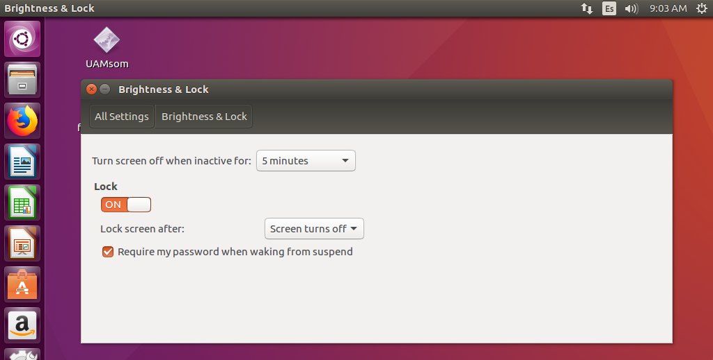

# Propuesta de solución del reto Una-al-mes de enero de 2019 de Hispasec por Ramón Sola ([@asterixco](https://twitter.com/asterixco))

Este mes de enero, UAM presenta el segundo episodio de la trilogía dedicada al *Universo Marvel*.

La investigación principal se ha llevado a cabo en la propia máquina virtual proporcionada con la distribución Ubuntu 16.04 LTS de GNU/Linux bajo el entorno VirtualBox. El sistema operativo anfitrión es irrelevante.

## Enunciado

El planteamiento de la prueba es el siguiente.

> Misión:
>
> Después de la explotación del programa de reclutamiento infiltramos a un informático como agente de Hydra. Tras unos días sin noticias, nos ha notificado que tiene en su poder el PC que utilizaban para las comunicaciones de los ataques, pero que este se ha visto afectado por un ransomware desconocido.
>
> Tu misión es conseguir desencriptar el archivo principal, entender las comunicaciones que realizan y conseguir la fecha del próximo ataque.
>
> Mucha suerte soldado.
>
> Nick Furia.

Se facilita el enlace de descarga de la máquina virtual  <https://drive.google.com/open?id=1AvXC-ywgpmPFTaQKlk2Wklx5eD_xBNUj>, comprimida en el archivo *Hydrabuntu.zip* de unos 2,2 GB de tamaño. Contiene los siguientes ficheros:

* credentials.txt
* Hydrabuntu.mf
* Hydrabuntu.ovf
* Hydrabuntu-disk1.vmdk

Como indicación adicional, la *flag* se define en función de una frase en mayúsculas y sin espacios.

<!-- markdownlint-disable MD033 -->
<div style="page-break-after: always;"></div>
<!-- markdownlint-enable MD033 -->

## Primera fase: arranque de la máquina virtual y examen preliminar

El proceso de importación y configuración de la máquina virtual está fuera del ámbito de este documento. Se suponen conocimientos previos al respecto. Aunque se creó con herramientas de VMware, puede usarse en Oracle VirtualBox. El formato de disco VMDK es propio de VMware, pero otras plataformas de virtualización también lo admiten y además es posible convertirlo a otros formatos.

La pantalla de inicio de sesión en el entorno gráfico solicita una contraseña para la cuenta de usuario **hydrauser**. De acuerdo con el fichero *credentials.txt* entregado con la máquina virtual, **hailhydra** permite entrar al escritorio.


En el escritorio aparecen los ficheros *UAMsom* y *flag.txt.uam*. La máquina virtual viene configurada con la zona horaria de Los Ángeles, la costa oeste de los Estados Unidos. No se ha modificado como parte de la resolución del reto.


Para evitar volver a introducir la contraseña de manera recurrente por inactividad, es conveniente revisar la configuración de bloqueo de la sesión. En la rueda dentada de la esquina superior derecha, *System Settings*, *Brightness and Lock*, se ha de cambiar *Lock* a **OFF**.



Las siguientes operaciones se llevarán a cabo exclusivamente en un terminal. Por ejemplo, puede hacerse clic derecho en el escritorio y elegir *Open Terminal*.


El terminal se abre de forma predeterminada en el directorio *home* (**~**) de la cuenta de usuario. El escritorio del entorno gráfico se corresponde con el subdirectorio *Desktop*. Para acceder a él se tecleará `cd Desktop`. Si el terminal se hubiera iniciado en una ruta diferente, entonces habría que incluir el símbolo **~**: `cd ~/Desktop`. Se puede ajustar el tamaño de los caracteres con las combinaciones de teclas *Ctrl +* y *Ctrl -*, y las opciones *Zoom In* y *Zoom Out* del menú *View*.

### Inspección básica de ficheros y pruebas de ejecución

Los segmentos de texto siguientes muestran un indicador o *prompt* simplificado (**\$** con usuario normal y **#** con *root*) para centrar la atención en los comandos introducidos y su salida. En las capturas de pantalla se puede ver el indicador real, que será **hydrauser@ubuntu:~/Desktop\$** o **root@ubuntu:~#** casi siempre. Adelantando acontecimientos, es posible elevarse a *root* con `sudo`.

```text
$ ls -l
total 28
-rw-rw-r-- 1 hydrauser hydrauser   108 Jan 15 04:15 flag.txt.uam
-rw-r--r-- 1 hydrauser hydrauser 23916 Jan 14 05:20 UAMsom
$ file UAMsom
UAMsom: ELF 32-bit LSB executable, Intel 80386, version 1 (SYSV), dynamically linked, interpreter /lib/ld-linux.so.2, for GNU/Linux 3.2.0, BuildID[sha1]=2e29b1a7bae71f06dea2f99a69f706d48af0335c, not stripped
$ xxd flag.txt.uam
00000000: 19c9 5c03 cee2 2783 5835 0b25 1680 f3e3  ..\...'.X5.%....
00000010: b165 41d3 39dd 26f6 3c14 93fb 1414 02a0  .eA.9.&.<.......
00000020: 455f 2c54 65c2 5afc f375 637f ea05 c9f8  E_,Te.Z..uc.....
00000030: b433 a26f 2540 0360 17f1 7515 3359 b790  .3.o%@.`..u.3Y..
00000040: a107 7b9e a962 25e5 7bae 28c9 3e70 c46f  ..{..b%.{.(.>p.o
00000050: d098 3790 adf2 1ae3 db51 86d6 595d 675a  ..7......Q..Y]gZ
00000060: 1b06 727a b791 c111 44a8 f2dd            ..rz....D...
```


Se constata que *UAMsom* es un ejecutable de tipo ELF y que *flag.txt.uam* parece estar cifrado (por lo menos su contenido es ininteligible), pero no se conoce el texto original del que supuestamente deriva. Se recomienda renombrar este segundo fichero para evitar su sobrescritura accidental. El nuevo nombre que se le dé será necesario más adelante. Si se intenta ejecutar *UAMsom* a continuación, dará un error de permiso denegado.

```text
$ mv flag.txt.uam flagenc
$ ls -l
total 28
-rw-rw-r-- 1 hydrauser hydrauser   108 Jan 15 04:15 flagenc
-rw-r--r-- 1 hydrauser hydrauser 23916 Jan 14 05:20 UAMsom
$ ./UAMsom
bash: ./UAMsom: Permission denied
```

Una observación atenta del listado permite ver que *UAMsom* carece del permiso de ejecución (**x**). Puesto que el propietario es *hydrauser*, se puede añadir directamente con `chmod`.

```text
$ chmod u+x UAMsom
$ ls -l
total 28
-rw-rw-r-- 1 hydrauser hydrauser   108 Jan 15 04:15 flagenc
-rwxr--r-- 1 hydrauser hydrauser 23916 Jan 14 05:20 UAMsom
```

Ahora sí se ejecutará.

```text
$ ./UAMsom
Welcome to UAMsomware

E: Could not open input file../flag.txt
Time: 1547745077
```

En primer lugar, informa de que no es capaz de abrir el fichero de entrada *flag.txt*. Además, indica un valor *Time*. Alguien experimentado tal vez sospeche en este mismo momento qué representa y de qué manera. A *UAMsom* se le puede proporcionar un fichero *flag.txt* arbitrario creado a propósito y observar qué hace con él.

```text
$ echo -n 'AAAAAAAAAAAAAAAAAAAA' > flag.txt
$ ./UAMsom
Welcome to UAMsomware

Time: 1547745199
$ ls -l
total 36
-rw-rw-r-- 1 hydrauser hydrauser   108 Jan 15 04:15 flagenc
-rw-rw-r-- 1 hydrauser hydrauser    20 Jan 17 09:13 flag.txt
-rw-rw-r-- 1 hydrauser hydrauser    20 Jan 17 09:13 flag.txt.uam
-rwxr--r-- 1 hydrauser hydrauser 23916 Jan 14 05:20 UAMsom
```


El valor *Time* es diferente y ha aparecido un fichero *flag.txt.uam*. ¿Qué contiene?

```text
$ xxd flag.txt.uam
00000000: d408 c418 63a9 149f 9200 607d 06d8 6eed  ....c.....`}..n.
00000010: 787e eea6                                x~..
```

Es ininteligible, en apariencia nada que ver con el `AAAAAAAAAAAAAAAAAAAA` original. ¿Y si se ejecuta *UAMsom* otra vez?

```text
$ ./UAMsom
Welcome to UAMsomware

Time: 1547745339
$ ls -l
-rw-rw-r-- 1 hydrauser hydrauser   108 Jan 15 04:15 flagenc
-rw-rw-r-- 1 hydrauser hydrauser    20 Jan 17 09:13 flag.txt
-rw-rw-r-- 1 hydrauser hydrauser    20 Jan 17 09:15 flag.txt.uam
-rwxr--r-- 1 hydrauser hydrauser 23916 Jan 14 05:20 UAMsom
$ xxd flag.txt.uam
00000000: a84a b026 4db5 43a8 d6cb dcaf 26d2 aa64  .J.&M.C.....&..d
00000010: e6c2 2737                                ..'7
```

El valor de *Time* y el contenido del fichero resultan ser diferentes respecto a la ejecución anterior. Además, su tamaño coincide con el *flag.txt* original, por lo que se puede suponer que no incluye ningún tipo de metadatos o información extra. ¿Quizá el cifrado dependa de la fecha y la hora y estas tengan relación con el valor *Time* imprimido? Se prueba una tercera vez.

```text
$ ./UAMsom
Welcome to UAMsomware

Time: 1547745377
$ ls -l
total 36
-rw-rw-r-- 1 hydrauser hydrauser   108 Jan 15 04:15 flagenc
-rw-rw-r-- 1 hydrauser hydrauser    20 Jan 17 09:13 flag.txt
-rw-rw-r-- 1 hydrauser hydrauser    20 Jan 17 09:16 flag.txt.uam
-rwxr--r-- 1 hydrauser hydrauser 23916 Jan 14 05:20 UAMsom
$ xxd flag.txt.uam
00000000: 4ef6 fa26 f77b 225e 6918 36e6 4a42 f50e  N..&.{"^i.6.JB..
00000010: 04fc 6d1e                                ..m.
```


Distintos de nuevo, y *Time* siempre creciente. ¿Y si el cifrado, además de depender de la fecha y la hora, fuese reversible? Es decir, en las condiciones adecuadas, al darle un fichero creado por él mismo como *flag.txt*, el fichero *flag.txt.uam* obtenido debería contener la información original. En el caso de que estas conjeturas resultasen ser verdaderas, el reto se simplificaría enormemente.

## Segunda fase: análisis de la ejecución

A lo largo de esta etapa se pretende evitar en la medida de lo posible dos tareas que consumen mucho tiempo de prueba y estudio: depuración e ingeniería inversa.

Como primera estrategia, tal vez las cadenas de caracteres del ejecutable sugieran alguna pista. Como la salida es muy larga y está mezclada con nombres de funciones y otros símbolos, se ha restringido al entorno de las cadenas más significativas.

```text
$ strings ./UAMsom
[...]
expa
nd 3
2-by
te k
IVIV
IVIV
expa
expa
UWVS
[^_]
basic_string::_M_construct null not valid
E: Could not create output file.
basic_string::append
.uam
E: Could not open input file.
Welcome to UAMsomware
./flag.txt
Time:
call!
push!
;*2$"
zPLR
Encrypting your files... :P
You are a looser!
expand 32-byte k
GCC: (Ubuntu 7.3.0-27ubuntu1~18.04) 7.3.0
Main.cpp
_ZNSt7__cxx1112basic_stringIcSt11char_traitsIcESaIcEE12_M_constructIPcEEvT_S7_St20forward_iterator_tag.isra.30
_ZNSt7__cxx1112basic_stringIcSt11char_traitsIcESaIcEE12_M_constructIPKcEEvT_S8_St20forward_iterator_tag.isra.33
_GLOBAL__sub_I_NUM_OF_BLOCKS_PER_CHUNK
_ZStL8__ioinit
crtstuff.c
[...]
```

Ya se han visto `Welcome to UAMsomware` y `Time:`. Destacan `./flag.txt` y el sufijo `.uam` de los ficheros de entrada y salida. Además, aparecen otras cadenas misteriosas como `call!`, `push!`, `Encrypting your files... :P`, `You are a looser!` (*sic*), de propósito y uso desconocido mientras no se haga un estudio más profundo. Sin embargo, la presencia de la cadena `expand 32-byte k` podría sugerir que el algoritmo de cifrado fuese [Salsa20](https://en.wikipedia.org/wiki/Salsa20) o alguna de sus variantes, como *ChaCha*; sin embargo, este detalle no se ha comprobado y conocerlo tampoco aporta nada a la resolución del desafío.

### No todo es GDB, IDA o Radare

Pese a la escasa renta obtenida con las cadenas de texto, aún es posible examinar el comportamiento del programa sin tener que recurrir a un depurador o un desensamblador. Por una parte, `strace` intercepta y muestra las llamadas al sistema, así como sus parámetros y su valor de retorno; por otra, `ltrace` registra las invocaciones a funciones de bibliotecas externas. Cuando se aplican a programas no demasiado simples, la salida puede resultar muy densa y difícil de comprender. Además, el texto imprimido por el propio programa tiende a mezclarse con la información que generan `strace` y `ltrace`.

```text
$ strace ./UAMsom
[...]
write(1, "Welcome to UAMsomware\n", 22Welcome to UAMsomware
) = 22
write(1, "\n", 1
)                       = 1
open("./flag.txt", O_RDONLY|O_LARGEFILE) = 3
open("./flag.txt.uam", O_WRONLY|O_CREAT|O_TRUNC|O_LARGEFILE, 0666) = 4
_llseek(3, 0, [20], SEEK_END)           = 0
_llseek(3, 0, [20], SEEK_CUR)           = 0
_llseek(3, 0, [0], SEEK_SET)            = 0
read(3, "AAAAAAAAAAAAAAAAAAAA", 8191)   = 20
write(4, "\227\371\316\24\32\362\21l\341U\313\253\214\264}t\357.\23b", 20) = 20
close(4)                                = 0
close(3)                                = 0
write(1, "Time: 1547745535\n", 17Time: 1547745535
)      = 17
exit_group(0)                           = ?
+++ exited with 0 +++
```


Efectivamente, `strace` confirma la suposición y la observación de que *flag.txt* es el fichero de entrada, pues se abre en modo de sólo lectura (**O_RDONLY**) y *flag.txt.uam* es el de salida, en modo de escritura (**O_WRONLY**). La opción **O_TRUNC** para escribir implica que, si el fichero ya existe, su tamaño se reduce a cero en el momento de la apertura, por tanto se pierde la información que contiene.

Nótese, aparte, cómo las dos llamadas a *open* devuelven los descriptores 3 y 4, puesto que el 0, el 1 y el 2 corresponden respectivamente a los flujos predeterminados de entrada estándar (en C, *stdin*; en C++, *std::cin*), salida estándar (*stdout* o *std::cout*) y salida de error (*stderr* o *std::cerr*). El descriptor 1 es el parámetro de las llamadas a *write* que imprimen los mensajes por la consola.

```text
$ ltrace ./UAMsom
[...]
srand(55, 0, 0x80000, 0x80494d8)                              = 0
malloc(32)                                                    = 0x9d00110
time(0)                                                       = 1547745571
srand(0x5c40b923, 0x8049507, 0x804ac25, 0x804ab80)            = 0
rand(0x804d000, 0, 0x804d000, 0x8049be6)                      = 0x247fc8d8
rand(0x804d000, 0, 0x804d000, 0x8049be6)                      = 0x4964abc2
rand(0x804d000, 0, 0x804d000, 0x8049be6)                      = 0xf2b3287
rand(0x804d000, 0, 0x804d000, 0x8049be6)                      = 0x35759da8
rand(0x804d000, 0, 0x804d000, 0x8049be6)                      = 0x1584ff26
rand(0x804d000, 0, 0x804d000, 0x8049be6)                      = 0x5f5b0360
rand(0x804d000, 0, 0x804d000, 0x8049be6)                      = 0x33781adb
rand(0x804d000, 0, 0x804d000, 0x8049be6)                      = 0x5e935471
[...]
```


Se aprecia en la salida de `ltrace` que *UAMsom* hace varias llamadas a funciones estándar de C como [time](https://en.cppreference.com/w/c/chrono/time), [srand](https://en.cppreference.com/w/c/numeric/random/srand) y [rand](https://en.cppreference.com/w/c/numeric/random/rand).

La función *time*, que recibe un puntero opcional como parámetro (puede ser 0 o NULL), calcula el [Tiempo Unix](https://es.wikipedia.org/wiki/Tiempo_Unix) o época (*Epoch*), un número generalmente entero que representa la fecha y hora del sistema como el número de segundos transcurridos desde la medianoche del 1 de enero de 1970 en zona horaria UTC. Como curiosidad, las implementaciones que limitan a 32 bits el tipo de datos son susceptibles al [problema del año 2038](https://es.wikipedia.org/wiki/Problema_del_a%C3%B1o_2038).

### Cuestión de azar... o la falta de él

> —Aquí tenemos nuestro generador de números aleatorios. Nueve, nueve, nueve, nueve, nueve, nueve...
>
> —¿Estás seguro de que eso es aleatorio?
>
> —Es el problema del azar. Nunca puedes estar seguro.

[Dilbert, 25 de octubre de 2001](https://dilbert.com/strip/2001-10-25)

Por otra parte, las funciones *srand* y *rand* están relacionadas entre ellas y tienen que ver con la [generación de números pseudoaleatorios](https://es.wikipedia.org/wiki/Generador_de_n%C3%BAmeros_pseudoaleatorios). La “s” significa *seed*, semilla, es decir, el valor que inicializa el generador. Una semilla da lugar a una secuencia numérica en llamadas sucesivas a *rand*. En los generadores más sencillos, que usan funciones matemáticas simples, aunque semillas diferentes produzcan secuencias distintas, cada semilla está relacionada con una secuencia fija y por tanto predecible.

Para conseguir hasta cierto punto que la sucesión de números pseudoaleatorios difiera en cada ejecución, un patrón usual de inicialización en lenguaje C es `srand(time(NULL))` o `srand(time(0))`. Los generadores en los que se basan *srand* y *rand* suelen ser rápidos y fáciles de usar, útiles en ciertas simulaciones, pero su principal debilidad reside en su sencillez. Los ficheros `/dev/random` y `/dev/urandom` en entornos de tipo Unix y la función *CryptGenRandom* en Microsoft Windows son fuentes de aleatoriedad más fiables, especialmente para aplicaciones criptográficas.

Puede verse cómo *UAMsom* invoca a *time* con el parámetro 0, lo que devuelve un número, y ese mismo valor se pasa a *srand*, solo que `ltrace` representa uno de ellos en base 10 y el otro en base 16 (hexadecimal). La aparición de parámetros adicionales parece ser más bien un “artefacto” derivado del hecho de que `ltrace` tal vez no conozca la [firma o signatura](https://en.wikipedia.org/wiki/Type_signature) exacta de las funciones. Se supone que los resultados de las llamadas a *rand*, que son exactamente 32, conforman la clave de entrada al algoritmo de cifrado.

```text
_ZNSi4readEPci(0xbfa59da4, 0xbf9d9ae0, 20, 0x8049be6)         = 0xbfa59da4
_ZNSo5writeEPKci(0xbfa59c90, 0xbf9d9ae0, 20, 0x8049be6)       = 0xbfa59c90
_ZNSt13basic_filebufIcSt11char_traitsIcEE5closeEv(0xbfa59c94, 0xbf9d9ae0, 20, 0x8049be6) = 0xbfa59c94
_ZNSt12__basic_fileIcED1Ev(0xbfa59ccc, 0xbf9d9ae0, 20, 0x8049be6) = 0
_ZNSt6localeD1Ev(0xbfa59cb0, 0xbf9d9ae0, 20, 0x8049be6)       = 20
_ZNSt8ios_baseD2Ev(0xbfa59d1c, 0xbf9d9ae0, 20, 0x8049be6)     = 19
_ZNSt13basic_filebufIcSt11char_traitsIcEE5closeEv(0xbfa59dac, 0xbf9d9ae0, 20, 0x8049be6) = 0xbfa59dac
_ZNSt12__basic_fileIcED1Ev(0xbfa59de4, 0xbf9d9ae0, 20, 0x8049be6) = 0
_ZNSt6localeD1Ev(0xbfa59dc8, 0xbf9d9ae0, 20, 0x8049be6)       = 18
_ZNSt8ios_baseD2Ev(0xbfa59e34, 0xbf9d9ae0, 20, 0x8049be6)     = 17
_ZSt16__ostream_insertIcSt11char_traitsIcEERSt13basic_ostreamIT_T0_ES6_PKS3_i(0xb7f65980, 0x804ac04, 6, 0x804920a) = 0xb7f65980
time(0)                                                       = 1547745571
_ZNSo9_M_insertIlEERSoT_(0xb7f65980, 0x5c40b923, 6, 0x804920a) = 0xb7f65980
_ZSt4endlIcSt11char_traitsIcEERSt13basic_ostreamIT_T0_ES6_(0xb7f65980, 0x5c40b923, 6, 0x804920aTime: 1547745571
) = 0xb7f65980
+++ exited (status 0) +++
```

Poco antes de terminar su ejecución, el programa vuelve a llamar a *time* y saca por pantalla el resultado con la indicación `Time:`. Virtualmente, deberían ser iguales tanto la semilla del generador de números aleatorios como el valor que se imprime. Sería muy desafortunado que se produjera un cambio de segundo entre las dos invocaciones.

Como información adicional, en el extracto anterior los nombres extraños que empiezan por _Z especifican decoraciones (*[name mangling](https://en.wikipedia.org/wiki/Name_mangling)*) de funciones y métodos de clase de C++ por parte del compilador GCC. Los símbolos decorados de GCC pueden resolverse a notación de C++ con la herramienta de línea de comandos `c++filt`, *Radare2* (`iD cxx <nombre>` dentro del intérprete interactivo o `rabin2 -D cxx <nombre>`), o páginas como <https://demangler.com>. C++ permite definir funciones y métodos de clase que coincidan en nombre, siempre que difieran en la cantidad o en los tipos de sus parámetros, así como agrupar identificadores en espacios de nombres. El formato de decoración está concebido para producir identificadores únicos e inequívocos que eviten ambigüedades en las distintas fases de compilación y enlazado. No existe un esquema de decoración universal.

### La TARDIS no siempre te lleva a donde tú quieres, pero sí a donde es necesario

A estas alturas, la idea de regresar a una fecha anterior para engañar a *UAMsom* se antoja factible. Que el cifrado dependa de este detalle crucial y sea reversible aún se encuentra en el terreno de las hipótesis. Es momento de ponerlo a prueba.

En una máquina virtual resulta fácil modificar la fecha y la hora del sistema. El ajuste automático con un servidor NTP debe estar desactivado. Sin embargo, se necesita una gran precisión para conseguir ejecutar *UAMsom* en el momento adecuado. Además, un cambio súbito de fecha puede provocar ciertos desajustes en *logs* o en procesos.

Existe una herramienta, con su correspondiente biblioteca, que permite falsificar la fecha y la hora en la ejecución de un programa específico mediante la interceptación de ciertas funciones relacionadas con tiempo: [faketime](http://manpages.ubuntu.com/manpages/trusty/man1/faketime.1.html). En entornos Windows, la utilidad [RunAsDate](https://www.nirsoft.net/utils/run_as_date.html) de NirSoft cumpliría el mismo propósito.

Para instalar *faketime* con `apt-get` se necesita que la máquina virtual esté conectada a Internet.

```text
$ apt-get install faketime
E: Could not open lock file /var/lib/dpkg/lock - open (13: Permission denied)
E: Unable to lock the administration directory (/var/lib/dpkg/), are you root?
```

Como se había anticipado, la máquina permite ejecutar programas como *root* con `sudo`. Si no hubiera sido así, habría bastado con trasladar de algún modo el ejecutable *UAMsom* y *flag.txt.uam* a otro sistema equivalente que sí se controlase por completo.

```text
$ sudo su -
[sudo] password for hydrauser:
# apt-get install faketime
Reading package lists... Done
Building dependency tree
Reading state information... Done
The following additional packages will be installed:
  libfaketime
The following NEW packages will be installed:
  faketime libfaketime
0 upgraded, 2 newly installed, 0 to remove and 256 not upgraded.
[...]
Preparing to unpack .../libfaketime_0.9.6-4_i386.deb ...
Unpacking libfaketime:i386 (0.9.6-4) ...
Selecting previously unselected package faketime.
Preparing to unpack .../faketime_0.9.6-4_i386.deb ...
Unpacking faketime (0.9.6-4) ...
Processing triggers for man-db (2.7.5-1) ...
Setting up libfaketime:i386 (0.9.6-4) ...
Setting up faketime (0.9.6-4) ...
# logout
$
```


Ahora bien, ¿qué fecha y hora habría que configurar en los controles de esta peculiar TARDIS? Ha estado delante todo el tiempo, oculta a plena vista, en los listados de `ls -l`. El comando `stat` ofrece la respuesta completa. Recuérdese que *flagenc* era el nuevo nombre que se le había dado a *flag.txt.uam* en un paso anterior. Además, la opción `-c %Y` muestra la fecha de modificación en forma de tiempo de Unix.

```text
$ stat flagenc
  File: 'flagenc'
  Size: 108             Blocks: 8          IO Block: 4096   regular file
Device: 801h/2049d      Inode: 1047348     Links: 1
Access: (0664/-rw-rw-r--)  Uid: ( 1000/hydrauser)   Gid: ( 1000/hydrauser)
Access: 2019-01-17 09:07:40.024009700 -0800
Modify: 2019-01-15 04:15:36.000000000 -0800
Change: 2019-01-17 09:09:34.964006647 -0800
 Birth: -
$ stat -c %Y flagenc
1547554536
```

*Faketime* acepta diversos formatos de fecha y hora, como `2019-01-15 04:36:15` o `@1547554536`. Basta con copiar de nuevo el antiguo *flag.txt.uam* (ahora *flagenc*) a *flag.txt* y simular la fecha y la hora adecuadas: 15 de enero de 2019 a las 04:15:36.

```text
$ cp flagenc flag.txt
$ faketime '2019-01-15 04:15:36' ./UAMsom
Welcome to UAMsomware

Time: 1547554536
$ ls -l
total 36
-rw-rw-r-- 1 hydrauser hydrauser   108 Jan 15 04:15 flagenc
-rw-rw-r-- 1 hydrauser hydrauser   108 Jan 17 09:24 flag.txt
-rw-rw-r-- 1 hydrauser hydrauser   108 Jan 17 09:27 flag.txt.uam
-rwxr--r-- 1 hydrauser hydrauser 23916 Jan 14 05:20 UAMsom
```

El valor de *Time* que emite el programa confirma el éxito de la operación. ¿Qué contendrá el fichero *flag.txt.uam* en esta ocasión? Si la hipótesis de partida era correcta, debería obtenerse algún texto coherente.

```text
$ cat flag.txt.uam
+20+234+33+20+55+7+20+7+968+355+886+355+56+355+7+20+356+968+34+218+355+55+355+34+20+45+20+504+355+39+886+39
```

Confirmada. La siguiente etapa consiste en entender qué significa semejante ristra de números y signos de suma.


<!-- markdownlint-disable MD033 -->
<div style="page-break-after: always;"></div>
<!-- markdownlint-enable MD033 -->

## Tercera fase: comprensión del mensaje misterioso

La primera impresión oscila entre la alegría de haber superado el obstáculo principal y la estupefacción ante el aspecto del nuevo oponente que se presenta. ¿Un código exótico? ¿Una curiosa operación matemática? Se repiten números. Además, algunos son inusualmente “grandes” respecto a otros.

> +20+234+33+20+55+7+20+7+968+355+886+355+56+355+7+20+356+968+34+218+355+55+355+34+20+45+20+504+355+39+886+39

Pocos días antes de la apertura del reto, uno de los coordinadores actuales de Una-al-mes, [Fernando Ramírez, declaró en un tuit](https://twitter.com/fdrg21/status/1083079138095886339):

> A que no sabíais que el nombre de ningún país empieza por W y X y solo uno por O y Q. Este tipo de cosas aprende uno preparando la #unaalmes

Y además [acotó](https://twitter.com/fdrg21/status/1083323772642488320): “En su nombre anglosajón”.

Países, iniciales, números, el signo “más”... ¿Dónde se suele ver eso? ¿Por qué empieza con **+20**? Por alguna razón, varios de esos números resultan ciertamente familiares. Que vayan precedidos del signo + refuerza esa sensación. ¿**+234**? El Banco de Nigeria le quiere hacer una donación: dé su nombre, dirección, teléfono, esmalte, número de pie, color de ojos y grupo sanguíneo. ¿**+34**? ¡Pero si es España! Así que Nick Furia se refería con esto a “entender las comunicaciones que realizan”. Hydra no solo parece tener mucha confianza en el servicio telefónico básico, sino que hace negocios abiertamente con medio mundo.

La clave está clara. Se trata de consultar la [lista de prefijos telefónicos internacionales](https://en.wikipedia.org/wiki/List_of_country_calling_codes) en la Wikipedia en inglés y tomar la inicial de cada país. La tabla siguiente resume la correspondencia entre códigos, países y letras:

Prefijo | País | Inicial en inglés
-------:|-----|----
+20 | Egipto | E
+218 | Libia | L
+234 | Nigeria | N
+33 | Francia | F
+34 | España | S
+355 | Albania | A
+356 | Malta | M
+39 | Italia | I
+45 | Dinamarca | D
+504| Honduras| H
+55| Brasil | B
+56 | Chile | C
+7| Rusia | R
+886 | Taiwán | T
+968| Omán| O

 De esta forma se obtiene la frase **EN FEBRERO ATACAREMOS LA BASE DE HAITÍ**. Habrá que avisar a las autoridades pertinentes en Puerto Príncipe para que tomen las medidas preventivas oportunas. Hydra no puede salirse con la suya.

Tan solo queda calcular el *hash* MD5 de la frase, sin espacios.

```text
$ echo -n 'ENFEBREROATACAREMOSLABASEDEHAITI' | md5sum
0f34e05951b864bd0621680af1f94acc -
```

Con lo cual, la *flag* buscada resulta ser **UAM{0f34e05951b864bd0621680af1f94acc}**.
