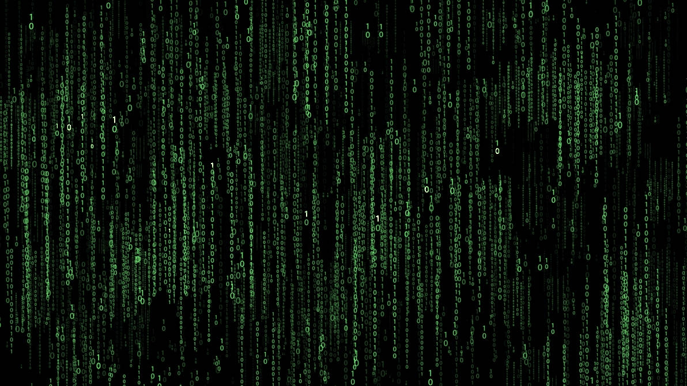
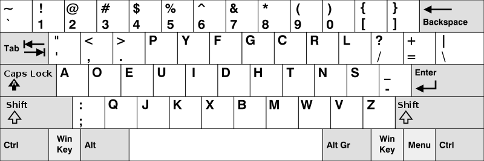
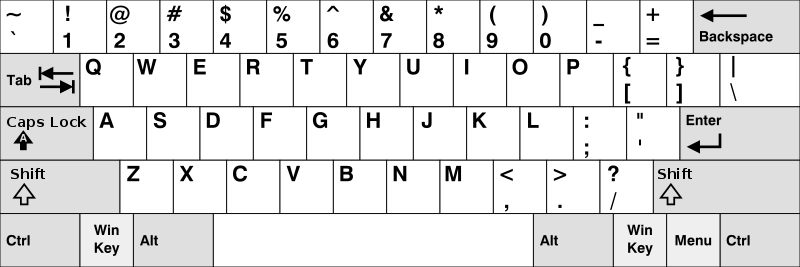

# Propuesta de solución del reto Una-al-mes de mayo de 2019 de Hispasec por Ramón Sola ([@asterixco](https://twitter.com/asterixco))

La serie de desafíos de UAM dedicada a la saga *Matrix* termina con una reivindicación del pensamiento creativo y la capacidad de adaptación que caracterizan a la mente humana, frente al poder computacional bruto y la destreza puramente mecánica en el manejo de las herramientas digitales.

## Enunciado

El tercer y último reto de la trilogía se plantea de la siguiente manera:

> Nos llevamos una muy grata sorpresa con el último rebelde. Este individuo posee unas capacidades extraordinarias. Su relación con Matrix parece mantener alguna forma de vigencia, aún encontrándose fuera de la simulación. De este modo, no sólo conseguimos anticiparnos a nuestros enemigos, sino que ahora contamos con un arma decisiva en nuestra filas.
>
> Es hora de utilizar su poder para desconectar definitivamente el sistema y ocupar el lugar que nos corresponde en el nuevo mundo.
>
> Los comandos que inician el proceso de desmantelamiento están almacenados de un modo que somos incapaces de comprender. El nuevo rebelde nos ha dado una valiosa pista: "Posiblemente, se requiera una mente que no esté tan limitada por los parámetros de la perfección". Necesitamos un razonamiento que no se apoye exclusivamente en la capacidad de cálculo, sino en aquel extraño atributo que los humanos llaman "intuición" y que, según ellos, les permite ver "más allá".
>
> Hemos comprobado que ni los programas más involucrados en la seguridad de la simulación como El Oráculo o El Creador de Llaves tienen autorizado el acceso a este recurso crítico. Tampoco las suplantaciones de identidad con los datos rebeldes funcionan. Ni siquiera nuestros agentes dobles pueden acceder a él.
>
> Es como si sólo alguien procedente de "FUERA DE LA SIMULACION" pudiera acceder al recurso sin disparar las alarmas.
>
> Una vez que consigas acceso al recurso, recuerda que no todos escribimos de la misma manera...

Se indica el enlace <http://34.247.69.86/matrix/episodio3/index.php> de la página web inicial.

<!-- markdownlint-disable MD033 -->
<div style="page-break-after: always;"></div>
<!-- markdownlint-enable MD033 -->

## Primera fase: ubicación simulada

La página, con título *Le matrix*, muestra el texto “SOLAMENTE PUEDES VER EL CONTENIDO SI VIENES DE FUERA DE LA SIMULACION”. Para una manipulación más sencilla de las peticiones HTTP, pueden usarse herramientas de línea de comandos como *wget* o *curl*.

Por ejemplo: `wget -O - -q http://34.247.69.86/matrix/episodio3/index.php`

```html
<html>
<head>
        <title>Le matrix</title>
</head>
<body>
SOLAMENTE PUEDES VER EL CONTENIDO SI VIENES DE FUERA DE LA SIMULACION...

</body>
```

El secreto está en descubrir qué quiere decir “fuera de la simulación”. ¿Acaso hay que usar un *proxy*, una VPN, la red Tor...? Si fuese así, ¿qué territorio o rango de direcciones IP? ¿Y establecer la cabecera HTTP *Referer* a un valor específico? Cualquiera de estas opciones era un disparo a ciegas.

Existe otra posibilidad. No es raro que los *proxies* HTTP añadan una cabecera extra a la petición con la IP de origen. No obstante, en la práctica, el *proxy* no necesita entregar una dirección real y el servidor web no tendría forma de comprobar si es verdadera o falsa, por tanto la fiabilidad de este dato resulta más que discutible. Se trata de la cabecera *X-Forwarded-For*.

En este caso, una lectura muy atenta del enunciado revela la solución exacta: literalmente, la cadena **FUERA DE LA SIMULACION** en lugar de una dirección IP reglamentaria. Con *wget* se emplearía la opción `--header`, como en `--header "X-Forwarded-For: FUERA DE LA SIMULACION"`.

```html
<html>
<head>
        <title>Le matrix</title>
</head>
<body>
http://34.247.69.86/matrix/episodio3/iuo1h2eipu1h2ieuo12h890dhas89hd9i1n2opudniukbnaksfjbnahjklfbu12981hfi1.jpg

</body>
```

Es más divertido imaginar el grácil paseo de un gato por el teclado que el vulgar repiqueteo de dedos para el “bautizo” de este recurso. Lógicamente, su nombre hacía prácticamente imposible su descubrimiento por otros medios. Además, el servidor web se protegía ante las peticiones masivas mediante un bloqueo temporal.

## Segunda fase: ensoñaciones binarias

El fichero .jpg consiste en un motivo decorativo formado por hileras verticales de unos y ceros verdes en distintos tamaños sobre fondo negro, al estilo de la *lluvia de letras* que representa las “entrañas” de la simulación de Matrix.



Al contrario que en la [pesadilla de Bender](https://www.youtube.com/watch?v=Fc00AyhDe5A), no se aprecia ningún dos. Sin embargo, hay varios números resaltados. Cuando se reduce el brillo y se aumenta el contraste con un editor de imágenes, se hacen más evidentes algunos dígitos que podían pasar desapercibidos a primera vista. Los once, leídos de izquierda a derecha, constituyen la secuencia de bits **10101111100**.

La imagen debe de esconder algún secreto. Según experiencias de esteganografía con *steghide* en retos anteriores, parece prudente intentar probar esta herramienta con la secuencia binaria como clave de ocultación: `steghide extract -sf imagen.jpg -p 10101111100`. El mensaje *wrote extracted data to "flag.txt"* confirma la corazonada. Si no, *could not extract any data with that passphrase!* habría indicado que la clave no era correcta o que no se había usado *steghide* para disimular la información.

## Tercera fase: un código poco convencional ¿para un nuevo mundo?

El fichero *flag.txt* obtenido presenta un tamaño de 53 bytes. Lo forman 52 caracteres imprimibles y un salto de línea. El nombre es suficientemente explícito como para comprender que la *flag* está ahí oculta.

`KGUB.;AfBI>2BhAfMI>4MmMfMhG5M;";M2KtF2UdRYedM;",u"]]`

Puesto que las *flags* habituales de Una-al-mes se componen de las letras **UAM**, las llaves de apertura y cierre, y los 32 dígitos hexadecimales en letras minúsculas de un *hash* MD5, es razonable pensar que el salto de 37 a 52 caracteres encaje con una de las codificaciones que expanden aproximadamente en un tercio la longitud original, como Base64 o incluso UUencode: un bloque de 4 caracteres por cada 3 bytes. El múltiplo de 3 más próximo por debajo es 36, que da lugar a 48 caracteres a la salida. El byte final produce un bloque adicional de otros 4 caracteres, incluido el oportuno relleno. Encontrar la cadena inicial **VUFN** reforzaría la hipótesis de una *flag* codificada en Base64.

Sin embargo, no se observa ninguna relación matemática coherente que pudiera sugerir un cifrado convencional por sustitución. La suposición de un alfabeto extendido con signos de puntuación tampoco se sostiene y la presencia de una posible transposición de los caracteres complicaría más el asunto. No puede ser tan enrevesado. ¿O sí?

Un nuevo repaso al enunciado del reto resulta inspirador: “recuerda que no todos escribimos de la misma manera”. ¿A qué forma de escritura se refiere? La línea de pensamiento acerca de ASCII, Unicode, sus derivados y otros códigos de caracteres relacionados parece poco prometedora. “Escribimos”. Ese “nosotros” implícito debe de referirse a los humanos. ¿Alfabetos? Latino, cirílico, chino, árabe, indio, japonés, tailandés... No, tampoco hay que irse tan lejos.

La respuesta correcta reside en un artefacto que cientos de millones de personas emplean en su día a día, fundamental en el gremio informático, y que lleva inscritos números, letras y otros caracteres tanto en sus versiones físicas como en las virtuales. Otras interfaces de comunicación entre humanos y máquinas, como el reconocimiento de voz o de escritura a mano y la interacción con entornos virtuales o de realidad aumentada, amenazan la hegemonía de este dispositivo ubicuo.

En España y otros países que usan el alfabeto latino, la secuencia de letras [QWERTY](https://es.wikipedia.org/wiki/Teclado_QWERTY) resulta sobradamente conocida para todos. No obstante, hay todo un mundo más allá. Un ejemplo suficientemente diferente es la [distribución de teclado Dvorak](https://es.wikipedia.org/wiki/Teclado_Dvorak). Aunque este apellido insinúe resonancias musicales, no está claro que el creador de la distribución, de nombre August, tuviera relación familiar con el célebre músico checo del siglo XIX, Antonin, universalmente conocido por su novena sinfonía, “del Nuevo Mundo”.

Efectivamente, la comparación entre las distribuciones [Dvorak](https://commons.wikimedia.org/wiki/File:KB_United_States_Dvorak.svg) y [QWERTY](https://commons.wikimedia.org/wiki/File:KB_United_States.svg) para Estados Unidos pone de manifiesto que este es el insólito método de sustitución aplicado a la *flag*, o más bien a su codificación en Base64. La transformación de **KGUB** en **VUFN** lo corrobora.



Dvorak: `KGUB.;AfBI>2BhAfMI>4MmMfMhG5M;";M2KtF2UdRYedM;",u"]]`



QWERTY: `VUFNezAyNGE2NjAyMGE4MmMyMjU5MzQzM2VkY2FhOTdhMzQwfQ==`

La página <http://wbic16.xedoloh.com/dvorak.html> permite la conversión automática con el botón *To QWERTY*. Como curiosidad, las letras A y M, además de los números, son de los pocos símbolos que mantienen la misma posición.

De un modo u otro, al decodificar con Base64 la cadena resultante se obtiene la *flag* `UAM{024a66020a82c22593433edcaa97a340}`, solución del desafío. Por otra parte, la página <https://www.md5online.org/md5-decrypt.html> revela que el *hash* proviene de **l4st_m4tr1x_ch4pt3r**.
