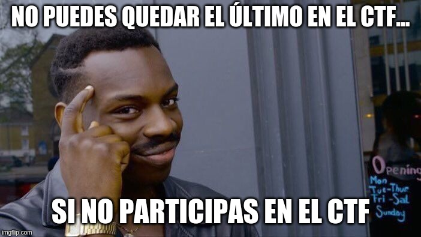

# Propuesta de solución del reto Una-al-mes de junio de 2019 de Hispasec por Ramón Sola ([@asterixco](https://twitter.com/asterixco))

Tras la resaca del congreso [UAD360](https://unaaldia.hispasec.com/2019/06/finaliza-uad360-el-primer-congreso-de-seguridad-informatica-de-la-provincia-de-malaga.html), que incluía un CTF bastante exigente, cabía esperar que la prueba de UAM fuese ligera tanto en su preparación como en su resolución. El nombre corrobora su bajo nivel de dificultad: **Easy Mode**.

## Enunciado

El desafío se plantea así:

> Vamos a ver la información que podéis conseguir de un dominio. Reto nivel fácil para no saturaros tras la uad360 :P
>
> La flag os va a gustar...
>
> Dominio: `lesaleapagar.e96e7c910b.com`

## Primera fase: quién osa entrar en mi dominio

El enunciado menciona expresamente obtener información de un dominio y no algo más específico como una página web, de modo que es razonable empezar por consultas DNS. Pueden emplearse las herramientas de línea de comandos **dig** y **nslookup**, o interfaces web que se apoyan en ellas, como <https://www.digwebinterface.com>, <https://toolbox.googleapps.com/apps/dig/>, <http://www.kloth.net/services/dig.php> o <http://www.geektools.com/digtool.php>.

La consulta solicita los registros **A** de forma predeterminada, pero el dominio **lesaleapagar.e96e7c910b.com** no tiene asociado ninguno de este tipo. Con **nslookup** en modo interactivo:

```text
> lesaleapagar.e96e7c910b.com
Server:         8.8.8.8
Address:        8.8.8.8#53

Non-authoritative answer:
*** Can't find lesaleapagar.e96e7c910b.com: No answer
```

Con `dig lesaleapagar.e96e7c910b.com`:

```text
;; QUESTION SECTION:
;lesaleapagar.e96e7c910b.com.   IN      A

;; AUTHORITY SECTION:
e96e7c910b.com.         599     IN      SOA     ns33.domaincontrol.com. dns.jomax.net. 2019061400 28800 7200 604800 600
```

Para que la consulta devuelva todos los registros, se debe ajustar la opción **type** de **nslookup** a **any** mediante `set type=any` en modo interactivo.

```text
> set type=any
> lesaleapagar.e96e7c910b.com
Server:         8.8.8.8
Address:        8.8.8.8#53

Non-authoritative answer:
lesaleapagar.e96e7c910b.com     text = "https|3a2f2f|drive|2e|google|2e|com|2f|open|3f|id|3d|1Qsbr5NdE|2d|FsX9JIZeFzvpKDJ1OOxzgj7|0a|"

Authoritative answers can be found from:
>
```

O bien, el parámetro `-type=any` en modo no interactivo: `nslookup -type=any lesaleapagar.e96e7c910b.com`. De forma análoga, se pasa el tipo **any** a **dig**: `dig any lesaleapagar.e96e7c910b.com`.

```text
;; QUESTION SECTION:
;lesaleapagar.e96e7c910b.com.   IN      ANY

;; ANSWER SECTION:
lesaleapagar.e96e7c910b.com. 1800 IN    TXT     "https|3a2f2f|drive|2e|google|2e|com|2f|open|3f|id|3d|1Qsbr5NdE|2d|FsX9JIZeFzvpKDJ1OOxzgj7|0a|"
```

La respuesta muestra un registro TXT con una cadena que parece la dirección de un fichero alojado en Google Drive. Sin embargo, está levemente ofuscada de manera muy simple.

```text
https|3a2f2f|drive|2e|google|2e|com|2f|open|3f|id|3d|1Qsbr5NdE|2d|FsX9JIZeFzvpKDJ1OOxzgj7|0a|
```

Consiste en grupos alternos de secuencias alfanuméricas y bytes en notación hexadecimal encerrados en barras verticales (`|`).

**Nota a posteriori:** este formato corresponde a la codificación de los datos de la [regla **content** en Snort](http://manual-snort-org.s3-website-us-east-1.amazonaws.com/node32.html#SECTION00451000000000000000).

He aquí un ejemplo simple de decodificación con Python.

```python
from binascii import unhexlify

s = 'https|3a2f2f|drive|2e|google|2e|com|2f|open|3f|id|3d|1Qsbr5NdE|2d|FsX9JIZeFzvpKDJ1OOxzgj7|0a|'
l = s.split('|')
u = []

for a, b in zip(l[::2], l[1::2]):
    u.append(a + unhexlify(b).decode('ascii'))

print(''.join(u))
```

El resultado es la URL <https://drive.google.com/open?id=1Qsbr5NdE-FsX9JIZeFzvpKDJ1OOxzgj7>.

## Segunda fase: ocultos a plena vista

La página de descarga conduce a un fichero **text.txt** con el contenido siguiente:

```text
https://unaaldia.hispasec.com/2019/03/una-al-dia-tendra-su-propio-congreso-de-seguridad-informatica-uad360.html

https://drive.google.com/file/d/1xRnh8JNhHR6MEdW8bysC9YL1KkcgV3c5/view?usp=sharing
```

La primera dirección es un artículo de Una-al-día. La segunda lleva a un archivo comprimido **imagen.zip** con un fichero **ctf.jpg** protegido por contraseña. Posiblemente en el código HTML o el texto del artículo esté la clave, tal vez una palabra o una frase.

Tras probar diversos términos como UAD360, UAD, UAM, Hispasec, etc., y combinaciones de mayúsculas o minúsculas, llama la atención una frase del artículo resaltada en negrita: “**La locomotora está en marcha**”. Finalmente, “locomotora” resulta ser la palabra buscada.

**Nota a posteriori:** probablemente el autor del desafío esperaba que se usase una herramienta de extracción de palabras, como [Cewl](https://digi.ninja/projects/cewl.php), y se generase un diccionario que alimentara una utilidad para probar contraseñas en ficheros ZIP, caso de [fcrackzip](http://oldhome.schmorp.de/marc/fcrackzip.html).



Una inspección básica de **ctf.jpg** revela de forma inmediata la *flag* en texto plano. [ExifTool](https://www.sno.phy.queensu.ca/~phil/exiftool/) pone de manifiesto que se encuentra en el campo *Artist* de los metadatos:

```text
File Type                       : JPEG
File Type Extension             : jpg
MIME Type                       : image/jpeg
JFIF Version                    : 1.01
Exif Byte Order                 : Big-endian (Motorola, MM)
X Resolution                    : 1
Y Resolution                    : 1
Resolution Unit                 : None
Artist                          : UAM{4ddcb848b6433e0649b69077a47da93c}
Y Cb Cr Positioning             : Centered
Image Width                     : 702
Image Height                    : 395
Encoding Process                : Progressive DCT, Huffman coding
Bits Per Sample                 : 8
Color Components                : 3
Y Cb Cr Sub Sampling            : YCbCr4:2:0 (2 2)
Image Size                      : 702x395
Megapixels                      : 0.277
```

Por tanto, la solución del reto es la cadena **UAM{4ddcb848b6433e0649b69077a47da93c}**. La búsqueda inversa del *hash* en la página <https://www.md5online.org/md5-decrypt.html> determina que proviene de **VimEsMejorQueNano**. La *flag* toma partido en el pequeño debate que ha habido en el grupo de Telegram de la Una-al-mes, trasladado a la cuenta de Twitter de Hispasec y su entorno, acerca del mejor editor de texto en el terminal: Vim o Nano.

- “Otro viernes, otro #HispaDebates. Hoy toca que votéis vuestro editor de texto en terminal favorito.” ([@hispasec](https://twitter.com/hispasec/status/1139517347675430912))
  - Vim (46 %), **Nano** (52 %), Micro (0 %) y Emacs (2 %), sobre 131 votos.
- “Ver a nano ganando a vim me hace perder la fe en la humanidad...” ([@devploit](https://twitter.com/devploit/status/1139852601724493824))
- “Donde se ponga un bloc de notas ...” ([@seguridadyredes](https://twitter.com/seguridadyredes/status/1139853260431532032))
- “Yo entiendo que en esta vida tiene que haber de todo... por eso hay gente que vota nano...” ([@devploit](https://twitter.com/devploit/status/1139880037094711296))
